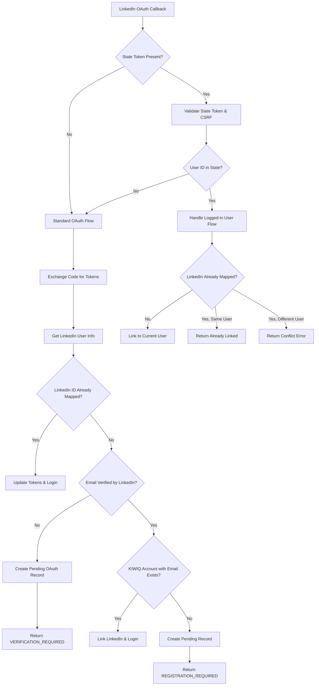
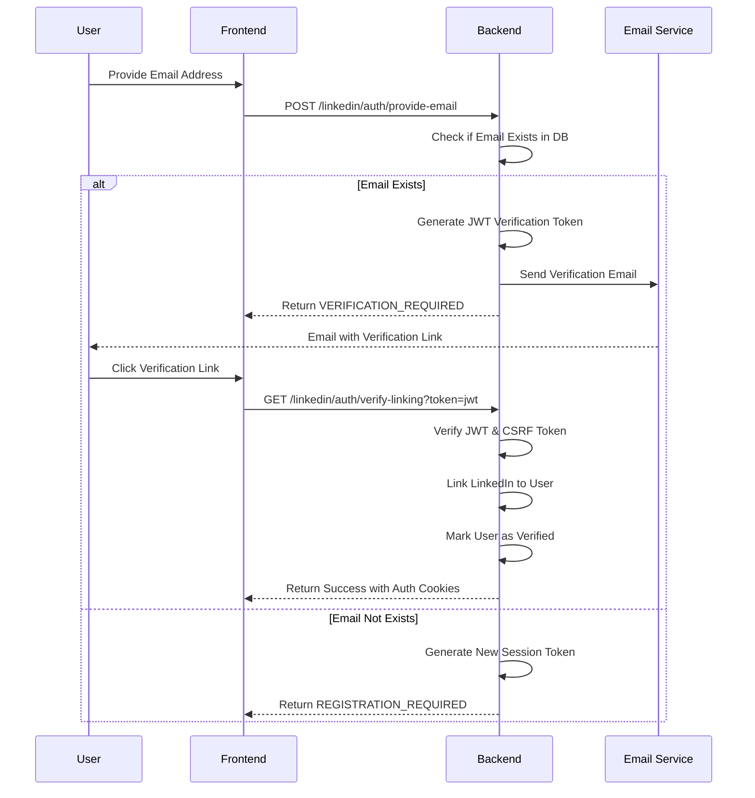
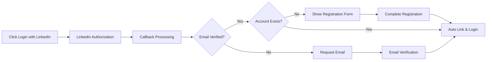
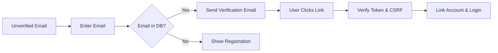
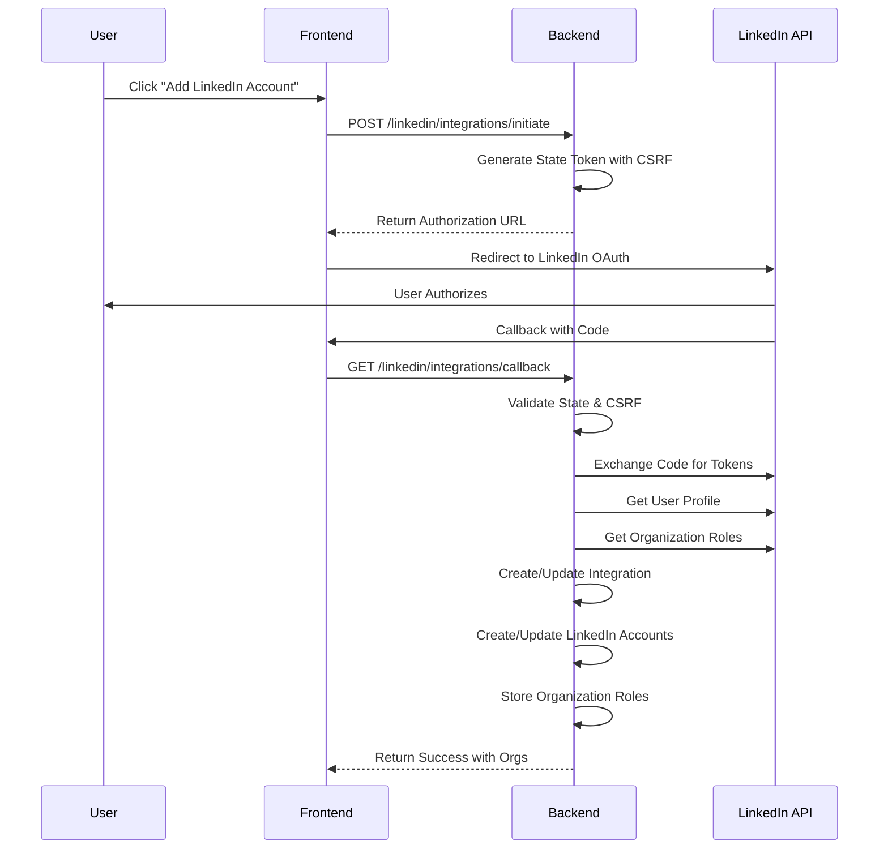
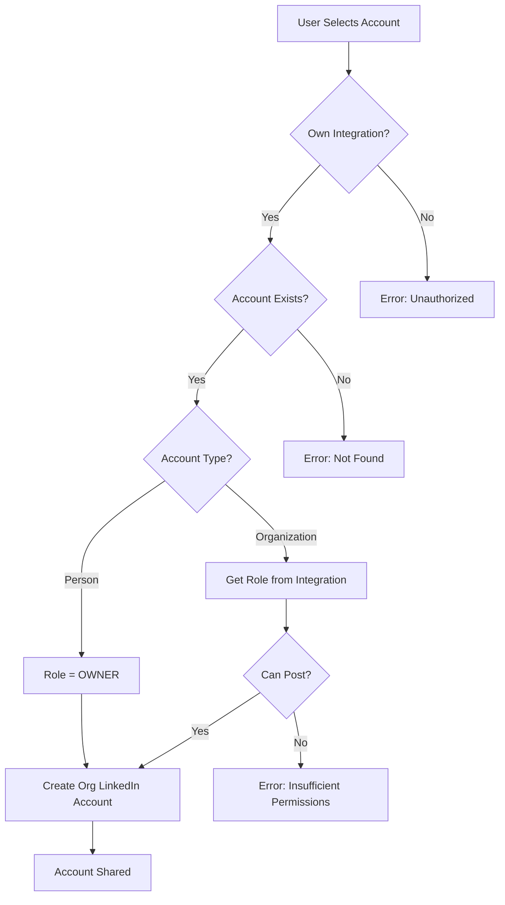
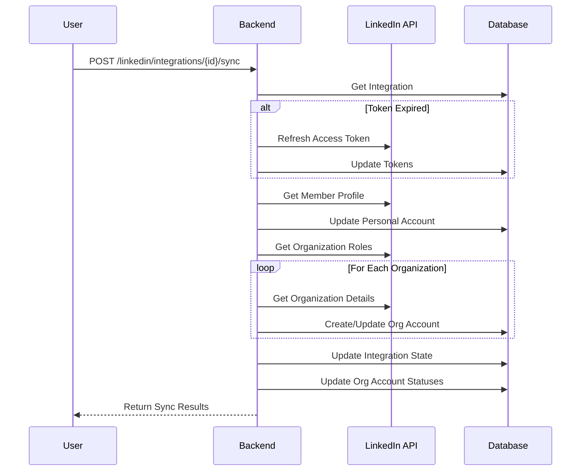
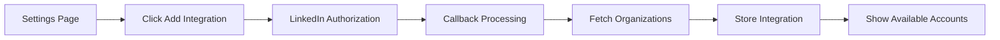
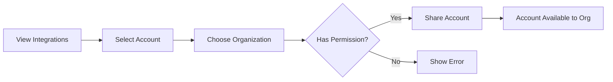
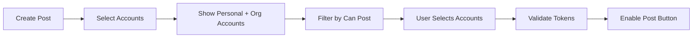

# LinkedIn OAuth & Integration Design Document

## Table of Contents

### Part 1: LinkedIn OAuth (Authentication)
1. [OAuth Overview](#oauth-overview)
2. [OAuth Architecture](#oauth-architecture)
3. [OAuth State Management](#oauth-state-management)
4. [OAuth Database Design](#oauth-database-design)
5. [OAuth Flow Diagrams](#oauth-flow-diagrams)
6. [OAuth Component Design](#oauth-component-design)
7. [OAuth API Design](#oauth-api-design)
8. [OAuth Frontend Requirements](#oauth-frontend-requirements)
9. [OAuth Security Design](#oauth-security-design)

### Part 2: LinkedIn Integrations (Multiple Account Management)
10. [Integration Overview](#integration-overview)
11. [Integration Architecture](#integration-architecture)
12. [Integration Database Design](#integration-database-design)
13. [Integration Flow Diagrams](#integration-flow-diagrams)
14. [Integration Component Design](#integration-component-design)
15. [Integration API Design](#integration-api-design)
16. [Integration Frontend Requirements](#integration-frontend-requirements)

### Common Sections
17. [Edge Cases & Error Handling](#edge-cases--error-handling)
18. [Monitoring & Operations](#monitoring--operations)

---

# Part 1: LinkedIn OAuth (Authentication)

## OAuth Overview

The LinkedIn OAuth system enables KIWIQ users to authenticate and sign up using their LinkedIn credentials. This is a **single sign-on (SSO)** solution for user authentication.

### OAuth Core Principles
- **Strict 1:1 Mapping**: One LinkedIn account maps to exactly one KIWIQ account (enforced via database constraints)
- **Dual Identity System**: KIWIQ uses user.id as primary identifier, LinkedIn uses Sub/ID
- **State-Driven Architecture**: All OAuth flows tracked through explicit state transitions
- **JWT-Based State Management**: Secure state tokens with CSRF protection
- **Multi-Flow Support**: Handles both logged-out (login/signup) and logged-in (account linking) flows

### OAuth Business Requirements
- Support LinkedIn-based signup for new users
- Enable LinkedIn login for existing LinkedIn-connected accounts  
- Allow existing KIWIQ users to link their LinkedIn accounts
- Handle both verified and unverified LinkedIn emails gracefully
- Provide secure token management with automatic refresh
- **Active Account Requirement**: All OAuth flows are only applicable to active KIWIQ user accounts
- **Automatic Email Verification**: LinkedIn-verified emails automatically verify KIWIQ accounts

## OAuth Architecture

### OAuth System Architecture
```
┌─────────────────┐     ┌──────────────────┐     ┌─────────────────┐
│                 │     │                  │     │                 │
│   Frontend      │────▶│  LinkedIn OAuth  │────▶│  LinkedIn API   │
│   Application   │     │     Service      │     │                 │
│                 │     │                  │     │                 │
└─────────────────┘     └──────────────────┘     └─────────────────┘
         │                       │
         │                       │
         ▼                       ▼
┌─────────────────┐     ┌──────────────────┐
│                 │     │                  │
│   Auth Service  │     │   Database       │
│                 │     │   (PostgreSQL)   │
│                 │     │                  │
└─────────────────┘     └──────────────────┘
```

### OAuth Service Dependencies
- **LinkedinOauthService**: Core service managing OAuth flows and state transitions
- **Auth Service**: Handles user authentication, registration, and session management
- **Email Service**: Manages verification emails for unverified LinkedIn emails
- **State Manager**: JWT-based state token generation and validation with CSRF protection
- **Background Workers**: Token refresh, expiration handling, cleanup jobs

## OAuth State Management

### OAuth State Machine Design

| State | Description | Entry Conditions | Exit Conditions | Next States |
|-------|-------------|------------------|-----------------|-------------|
| PENDING | OAuth flow initiated | User starts OAuth | Callback received | ACTIVE, VERIFICATION_REQUIRED, REGISTRATION_REQUIRED, ERROR |
| VERIFICATION_REQUIRED | Email verification needed | Unverified LinkedIn email | User verifies account | ACTIVE, ERROR |
| REGISTRATION_REQUIRED | New user registration | No existing KIWIQ account | Registration completed | ACTIVE, ERROR |
| ACTIVE | Fully functional | Successful linking | Token expires, user unlinks | EXPIRED, REVOKED |
| EXPIRED | Tokens expired | Access token expires | Successful refresh | ACTIVE, ERROR |
| ERROR | Failed state | Any error condition | User retries | ACTIVE, REVOKED |
| REVOKED | Terminated connection | User unlinks, admin action | N/A | None (terminal state) |
| PENDING_DELETION | User has initiated deletion | User action | Deletion complete | REVOKED |

### OAuth State Metadata Schema
```json
{
  "timestamp": "ISO-8601 timestamp",
  "trigger": "user_action|system|timeout",
  "previous_state": "state_name",
  "reason": "state_reason",
  "details": {
    // State-specific metadata
  }
}
```

### JWT Token Types

1. **OAuth State Token** (`oauth_state`)
   - Purpose: CSRF protection during OAuth flow
   - Expiry: 10 minutes
   - Contains: `state_id`, `user_id` (optional), `logged_in_flow`, `csrf_token`
   
2. **OAuth Session Token** (`oauth_session`)
   - Purpose: Store non-sensitive data for incomplete flows
   - Expiry: 30 minutes
   - Contains: `linkedin_id`, `email`, `name`, `email_verified`
   
3. **Email Verification Token** (`linkedin_verification`)
   - Purpose: Verify email ownership for account linking
   - Expiry: 1440 minutes (24 hours)
   - Contains: `user_id`, `email`, `linkedin_id`, `csrf_token`

## OAuth Database Design

### LinkedIn OAuth Model

**Table: linkedin_oauth**
| Column | Type | Constraints | Description |
|--------|------|-------------|-------------|
| id | VARCHAR(255) | PRIMARY KEY | LinkedIn Sub/ID |
| user_id | UUID | UNIQUE, NOT NULL, FK(users) | KIWIQ user reference |
| oauth_state | VARCHAR(50) | NOT NULL, INDEX | Current state from state machine |
| state_metadata | JSONB | NULL | State-specific metadata |
| access_token | TEXT | NOT NULL | Encrypted OAuth access token |
| refresh_token | TEXT | NULL | Encrypted OAuth refresh token |
| scope | TEXT | NOT NULL | Space-delimited permissions |
| expires_in | INTEGER | NOT NULL | Token validity in seconds |
| refresh_token_expires_in | INTEGER | NULL | Refresh token validity |
| token_expires_at | TIMESTAMP | NULL, INDEX | Calculated expiration |
| refresh_token_expires_at | TIMESTAMP | NULL | Refresh token expiration |
| created_at | TIMESTAMP | NOT NULL | Record creation time |
| updated_at | TIMESTAMP | NOT NULL | Last update time |

**Indexes:**
- PRIMARY KEY on `id` (LinkedIn Sub)
- UNIQUE constraint on `user_id` (enforces 1:1 mapping)
- INDEX on `oauth_state` for state queries
- INDEX on `token_expires_at` for expiration queries

## OAuth Flow Diagrams

### 1. Main OAuth Callback Flow


### 2. Email Verification Flow


## OAuth Component Design

### LinkedinOauthService
**Purpose**: Core business logic for OAuth flows

**Key Methods:**
| Method | Purpose | Input | Output |
|--------|---------|-------|--------|
| initiate_oauth_flow | Start OAuth with CSRF token | redirect_uri, user_id, csrf_token | LinkedInInitiateResponse |
| process_oauth_callback | Handle OAuth callback | code, state, csrf_cookie | OauthCallbackResult |
| complete_registration | Finalize new user signup | registration data, state data | User, OAuth record |
| send_linkedin_verification_email | Send JWT verification email | email, linkedin_id, csrf_token | bool |
| verify_linking_token | Complete linking via JWT | jwt token, csrf_cookie | User, OAuth record |
| handle_provided_email | Process user-provided email | email, state data | ProvideEmailResult |
| link_existing_account | Link to existing account | credentials, state data | User, OAuth record |
| refresh_access_token | Refresh expired token | user_id | New tokens |
| unlink_linkedin_account | Remove LinkedIn connection | user_id | bool |

### LinkedinOauthDAO
**Purpose**: Data access layer for OAuth records

**Key Operations:**
- **create_or_update**: Atomic upsert with state management
- **update_state**: State transition with validation
- **update_tokens**: Token refresh operations
- **get_by_user_id**: Get OAuth record by KIWIQ user
- **mark_expired_tokens**: Batch expiration handling
- **admin_delete_***: Administrative deletion methods

### LinkedInStateManager
**Purpose**: JWT-based token management with CSRF protection

**Token Creation Methods:**
- `create_state_token`: OAuth flow state with CSRF
- `create_oauth_session_token`: Incomplete flow data storage
- `create_email_verification_token`: Email verification with CSRF

**Token Verification Methods:**
- `verify_state_token`: Validate OAuth state
- `verify_oauth_session_token`: Validate session data
- `verify_email_verification_token`: Validate email verification

## OAuth API Design

### Public OAuth Endpoints

| Endpoint | Method | Purpose | Request | Response |
|----------|--------|---------|---------|----------|
| /linkedin/auth/initiate | GET | Start OAuth flow | redirect_url | { authorization_url } |
| /linkedin/auth/callback | GET | OAuth callback | code, state, error | OauthCallbackResponse |
| /linkedin/auth/complete-registration | POST | New user signup | CompleteLinkedinRegistration | { access_token, user } |
| /linkedin/auth/provide-email | POST | Provide missing email | ProvideEmail | ProvideEmailResult |
| /linkedin/auth/verify-linking | GET | Verify email link | token | OauthVerificationResponse |

### Protected OAuth Endpoints

| Endpoint | Method | Purpose | Request | Response |
|----------|--------|---------|---------|----------|
| /linkedin/me/connection | GET | Get connection status | - | LinkedinConnectionStatus |
| /linkedin/me/unlink | DELETE | Unlink account | { confirm: true } | 204 No Content |
| /linkedin/me/refresh-token | POST | Force token refresh | - | { success, expires_in } |

### Admin OAuth Endpoints

| Endpoint | Method | Purpose | Request | Response |
|----------|--------|---------|---------|----------|
| /admin/linkedin/oauth/delete-by-linkedin-id | DELETE | Delete by LinkedIn ID | AdminDeleteLinkedinOauthByLinkedinId | AdminDeleteLinkedinOauthResponse |
| /admin/linkedin/oauth/delete-by-user-id | DELETE | Delete by user ID | AdminDeleteLinkedinOauthByUserId | AdminDeleteLinkedinOauthResponse |
| /admin/linkedin/oauth/list | GET | List all OAuth records | limit, offset | AdminLinkedinOauthListResponse |

## OAuth Frontend Requirements

### OAuth Frontend Architecture

#### State Management
```typescript
interface LinkedInOAuthState {
  currentFlow: 'logged-out' | 'logged-in' | 'verification' | 'registration';
  isLoading: boolean;
  error: string | null;
  
  userInfo?: {
    email?: string;
    name?: string;
    linkedin_id?: string;
    existing_account_email?: string;
    email_verified?: boolean;
  };
  
  requiresAction: boolean;
  actionType?: OauthAction;
  redirectUrl?: string;
}
```

#### OAuth Component Architecture
```
OAuth Components
├── LinkedInAuthButton (initiate OAuth)
├── LinkedInCallbackHandler (process callbacks)
├── LinkedInRegistrationForm (complete registration)
├── EmailProvisionForm (provide missing email)
├── LinkedInVerificationPage (email verification)
├── LinkedInConflictResolver (handle conflicts)
└── LinkedInConnectionStatus (show connection status)
```

### OAuth Routes

| Route | Component | Purpose | Access |
|-------|-----------|---------|--------|
| `/login` | LoginPage | Login with LinkedIn button | Public |
| `/register` | RegisterPage | Registration with LinkedIn | Public |
| `/auth/linkedin-callback` | LinkedInCallbackHandler | Process OAuth callback | Public |
| `/auth/linkedin-verify` | LinkedInVerificationPage | Email verification | Public |
| `/verify-account?linkedin=true` | LinkedInAccountVerification | Account verification | Public |
| `/settings/linkedin` | LinkedInSettingsPage | Manage connection | Private |

### OAuth User Flows

#### 1. New User Registration Flow


#### 2. Email Verification Flow


### OAuth CSRF Protection

```typescript
class OAuthCSRFManager {
  // Generate CSRF token for OAuth initiation
  generateCSRFToken(): string {
    return crypto.randomBytes(32).toString('hex');
  }
  
  // Store CSRF token in httpOnly cookie
  setCSRFCookie(response: Response, token: string): void {
    response.cookie('XSRF-TOKEN', token, {
      httpOnly: false, // Must be readable by JS
      secure: true,
      sameSite: 'lax'
    });
  }
  
  // Validate CSRF token from cookie against JWT
  validateCSRF(cookieToken: string, jwtToken: string): boolean {
    return cookieToken === jwtToken;
  }
}
```

## OAuth Security Design

### OAuth Token Security
1. **Storage Security**
   - AES-256-GCM encryption for tokens at rest
   - Separate encryption keys per environment
   - Tokens never logged or exposed in errors

2. **CSRF Protection**
   - State parameter with embedded CSRF token
   - CSRF token validation on all state transitions
   - Secure cookie attributes

3. **JWT Security**
   - Short expiration times (10-30 minutes)
   - Token type validation
   - Secure signing with HS256

4. **Rate Limiting**
   - OAuth initiate: 10/minute per IP
   - OAuth callback: 20/minute per IP
   - Verification request: 5/minute per email

---

# Part 2: LinkedIn Integrations (Multiple Account Management)

## Integration Overview

The LinkedIn Integration system enables KIWIQ users to manage multiple LinkedIn accounts and organizations for content posting and analytics. This is **separate from OAuth login**.

### Integration Core Principles
- **Multiple Account Support**: Users can add multiple LinkedIn integrations
- **Organization Management**: Access and manage LinkedIn organization pages
- **Role-Based Permissions**: Respect LinkedIn's role permissions (ADMINISTRATOR, DIRECT_SPONSORED_CONTENT_POSTER)
- **Shared Access**: Share LinkedIn accounts within KIWIQ organizations
- **Token Lifecycle**: Independent token management per integration

### Integration Business Requirements
- Add multiple LinkedIn accounts for management
- Access LinkedIn organization pages with appropriate permissions
- Share LinkedIn accounts within KIWIQ organizations
- Sync account data and permissions from LinkedIn
- Support posting on behalf of organizations
- Track integration status and health

## Integration Architecture

### Integration System Architecture
```
┌─────────────────┐     ┌──────────────────────┐     ┌─────────────────┐
│                 │     │                      │     │                 │
│   Frontend      │────▶│ LinkedIn Integration │────▶│  LinkedIn API   │
│   Application   │     │      Service         │     │                 │
│                 │     │                      │     │                 │
└─────────────────┘     └──────────────────────┘     └─────────────────┘
         │                       │
         │                       │
         ▼                       ▼
┌─────────────────┐     ┌──────────────────────┐
│                 │     │                      │
│  Organization   │     │      Database        │
│   Management    │     │   (PostgreSQL)       │
│                 │     │                      │
└─────────────────┘     └──────────────────────┘
```

### Integration Service Dependencies
- **LinkedinIntegrationService**: Core service for integration management
- **Organization Service**: Manages KIWIQ organization access
- **LinkedIn Client**: API client for LinkedIn operations
- **Background Sync**: Periodic synchronization of account data

## Integration Database Design

### Integration Models

**Table: linkedin_integration**
| Column | Type | Constraints | Description |
|--------|------|-------------|-------------|
| id | UUID | PRIMARY KEY | Integration identifier |
| user_id | UUID | NOT NULL, FK(users), INDEX | User who owns integration |
| linkedin_id | VARCHAR(255) | NOT NULL, INDEX | LinkedIn sub/ID |
| access_token | TEXT | NULL | Encrypted access token |
| refresh_token | TEXT | NULL | Encrypted refresh token |
| scope | VARCHAR | NULL | OAuth scopes |
| expires_in | INTEGER | NULL | Token validity |
| refresh_token_expires_in | INTEGER | NULL | Refresh token validity |
| token_expires_at | TIMESTAMP | NULL | Calculated expiration |
| refresh_token_expires_at | TIMESTAMP | NULL | Refresh expiration |
| integration_state | VARCHAR(50) | NOT NULL, INDEX | State (active/expired/revoked) |
| linkedin_orgs_roles | JSONB | NULL | Organizations and user roles |
| last_sync_at | TIMESTAMP | NULL | Last synchronization |
| created_at | TIMESTAMP | NOT NULL | Creation time |
| updated_at | TIMESTAMP | NOT NULL | Last update |

**Unique Constraint:** (user_id, linkedin_id)

**Table: linkedin_account**
| Column | Type | Constraints | Description |
|--------|------|-------------|-------------|
| id | VARCHAR(255) | PRIMARY KEY | LinkedIn ID (URN for orgs) |
| account_type | VARCHAR(50) | NOT NULL | person/organization |
| name | VARCHAR(500) | NULL | Account name |
| vanity_name | VARCHAR(255) | NULL, INDEX | LinkedIn username/slug |
| profile_data | JSONB | NULL | Cached profile data |
| last_updated_at | TIMESTAMP | NULL | Profile update time |
| created_at | TIMESTAMP | NOT NULL | Creation time |
| updated_at | TIMESTAMP | NOT NULL | Last update |

**Table: linkedin_org_account**
| Column | Type | Constraints | Description |
|--------|------|-------------|-------------|
| id | UUID | PRIMARY KEY | Record identifier |
| linkedin_account_id | VARCHAR(255) | NOT NULL, FK, INDEX | LinkedIn account |
| linkedin_integration_id | UUID | NOT NULL, FK, INDEX | Integration used |
| managed_by_user_id | UUID | NOT NULL, FK, INDEX | Managing user |
| organization_id | UUID | NOT NULL, FK, INDEX | KIWIQ organization |
| role_in_linkedin_entity | VARCHAR(100) | NULL | User's LinkedIn role |
| is_shared | BOOLEAN | DEFAULT TRUE, INDEX | Shared with org |
| is_active | BOOLEAN | DEFAULT TRUE, INDEX | Active status |
| status | VARCHAR(50) | NOT NULL, INDEX | Status (active/expired) |
| created_at | TIMESTAMP | NOT NULL | Creation time |
| updated_at | TIMESTAMP | NOT NULL | Last update |

**Unique Constraint:** (linkedin_account_id, organization_id, linkedin_integration_id)

## Integration Flow Diagrams

### 1. Add LinkedIn Integration Flow


### 2. Share Account with Organization Flow


### 3. Sync Integration Flow


## Integration Component Design

### LinkedinIntegrationService
**Purpose**: Manages multiple LinkedIn account integrations

**Key Methods:**
| Method | Purpose | Input | Output |
|--------|---------|-------|--------|
| initiate_integration_flow | Start integration OAuth | user_id, redirect_uri, csrf_token | LinkedinIntegrationInitiateResponse |
| process_integration_callback | Handle OAuth callback | user_id, code, state, csrf_cookie | LinkedinIntegrationCallbackResponse |
| list_user_integrations | Get user's integrations | user_id | LinkedinIntegrationListResponse |
| share_linkedin_account_with_org | Share account with org | user_id, org_id, account data | OrgLinkedinAccountRead |
| list_org_linkedin_accounts | List org's accounts | org_id, filters | OrgLinkedinAccountListResponse |
| sync_integration | Sync integration data | user_id, integration_id | SyncIntegrationResponse |
| delete_integration | Remove integration | user_id, integration_id | bool |
| list_user_accessible_accounts | Get all accessible accounts | user_id | UserAccessibleLinkedinAccountsResponse |

### Integration DAO Classes
- **LinkedinIntegrationDAO**: Manages integration records
- **LinkedinAccountDAO**: Manages LinkedIn account entities
- **OrgLinkedinAccountDAO**: Manages organization-shared accounts

## Integration API Design

### Integration Endpoints

| Endpoint | Method | Purpose | Request | Response |
|----------|--------|---------|---------|----------|
| /linkedin/integrations/initiate | POST | Start integration OAuth | - | LinkedinIntegrationInitiateResponse |
| /linkedin/integrations/callback | GET | OAuth callback | code, state | LinkedinIntegrationCallbackResponse |
| /linkedin/integrations | GET | List integrations | - | LinkedinIntegrationListResponse |
| /linkedin/integrations/{id} | DELETE | Delete integration | - | 204 No Content |
| /linkedin/integrations/{id}/sync | POST | Sync integration | - | SyncIntegrationResponse |
| /linkedin/integrations/refresh-all | POST | Refresh all integrations | - | RefreshAllIntegrationsResponse |
| /linkedin/accounts/accessible | GET | List accessible accounts | - | UserAccessibleLinkedinAccountsResponse |

### Organization Account Endpoints

| Endpoint | Method | Purpose | Request | Response |
|----------|--------|---------|---------|----------|
| /orgs/{org_id}/linkedin-accounts | GET | List org accounts | active_only, shared_only | OrgLinkedinAccountListResponse |
| /orgs/{org_id}/linkedin-accounts | POST | Share account | OrgLinkedinAccountCreate | OrgLinkedinAccountRead |
| /orgs/{org_id}/linkedin-accounts/{id} | PATCH | Update account | OrgLinkedinAccountUpdate | OrgLinkedinAccountRead |
| /orgs/{org_id}/linkedin-accounts/{id} | DELETE | Remove account | - | 204 No Content |

## Integration Frontend Requirements

### Integration State Management
```typescript
interface LinkedInIntegrationState {
  integrations: LinkedinIntegration[];
  selectedIntegration: LinkedinIntegration | null;
  accessibleAccounts: {
    personal: LinkedinAccountWithRole | null;
    organizations: LinkedinAccountWithRole[];
  };
  isLoading: boolean;
  isSyncing: boolean;
  error: string | null;
}

interface LinkedinAccountWithRole {
  account: LinkedinAccount;
  role: string | null;
  integration_id: string;
  integration_state: string;
  can_post: boolean;
}
```

### Integration Components
```
Integration Components
├── LinkedInIntegrationList (show all integrations)
├── AddIntegrationButton (initiate new integration)
├── IntegrationCallbackHandler (process OAuth)
├── IntegrationCard (display integration details)
├── SyncIntegrationButton (manual sync)
├── LinkedInAccountSelector (select accounts for posting)
├── OrganizationAccountList (show org's LinkedIn accounts)
└── ShareAccountModal (share account with org)
```

### Integration Routes

| Route | Component | Purpose | Access |
|-------|-----------|---------|--------|
| `/settings/linkedin-integrations` | LinkedInIntegrationsPage | Manage integrations | Private |
| `/linkedin/integrations/callback` | IntegrationCallbackHandler | OAuth callback | Private |
| `/org/linkedin-accounts` | OrgLinkedInAccountsPage | Manage org accounts | Private |
| `/content/new` | ContentCreationPage | Select accounts for posting | Private |

### Integration User Flows

#### 1. Add Integration Flow


#### 2. Share Account Flow


#### 3. Post Creation Flow


---

# Common Sections

## Edge Cases & Error Handling

### Common Error Scenarios

| Error Type | Handling Strategy | User Experience |
|------------|------------------|-----------------|
| Token Expired | Auto-refresh attempt | Transparent refresh |
| Refresh Failed | Mark as expired | Prompt re-authorization |
| Network Error | Retry with backoff | Show retry option |
| Account Conflict | Show detailed message | Guide resolution |
| Permission Denied | Clear error message | Explain requirements |
| Rate Limited | Queue and retry | Show status message |

### Error Response Format
```json
{
  "success": false,
  "error": {
    "code": "LINKEDIN_TOKEN_EXPIRED",
    "message": "Your LinkedIn connection has expired",
    "details": {
      "integration_id": "uuid",
      "expired_at": "2024-01-01T00:00:00Z"
    },
    "actions": ["reauthorize", "remove_integration"]
  }
}
```

## Monitoring & Operations

### Key Metrics

#### OAuth Metrics
- OAuth initiation rate
- Callback success rate
- Registration completion rate
- Token refresh success rate
- Active connections count

#### Integration Metrics
- Integrations per user
- Organizations per integration
- Sync success rate
- Token expiration distribution
- API call volume by integration

### Operational Procedures

#### Background Jobs
1. **Token Expiration Checker** (Hourly)
   - Check OAuth tokens expiring in 48 hours
   - Check integration tokens expiring in 48 hours
   - Attempt refresh for active users
   - Update states for failed refreshes

2. **Integration Sync** (Daily)
   - Sync organization changes
   - Update account permissions
   - Refresh profile data
   - Clean up inactive integrations

3. **Cleanup Jobs** (Daily)
   - Remove PENDING OAuth states > 24 hours
   - Archive expired integrations > 30 days
   - Clean orphaned account records

### Alerts & Monitoring
1. **Critical Alerts**
   - OAuth callback error rate > 5%
   - Token refresh failure rate > 10%
   - LinkedIn API downtime
   - Database connection issues

2. **Warning Alerts**
   - High token expiration rate
   - Sync failures > 20%
   - Increased API latency
   - Low integration adoption

### Security Considerations
1. **Data Protection**
   - Encrypt all tokens at rest
   - Use secure cookies for CSRF
   - Implement rate limiting
   - Audit all admin actions

2. **Access Control**
   - Validate ownership on all operations
   - Respect LinkedIn permissions
   - Organization-level access control
   - Admin-only deletion methods
