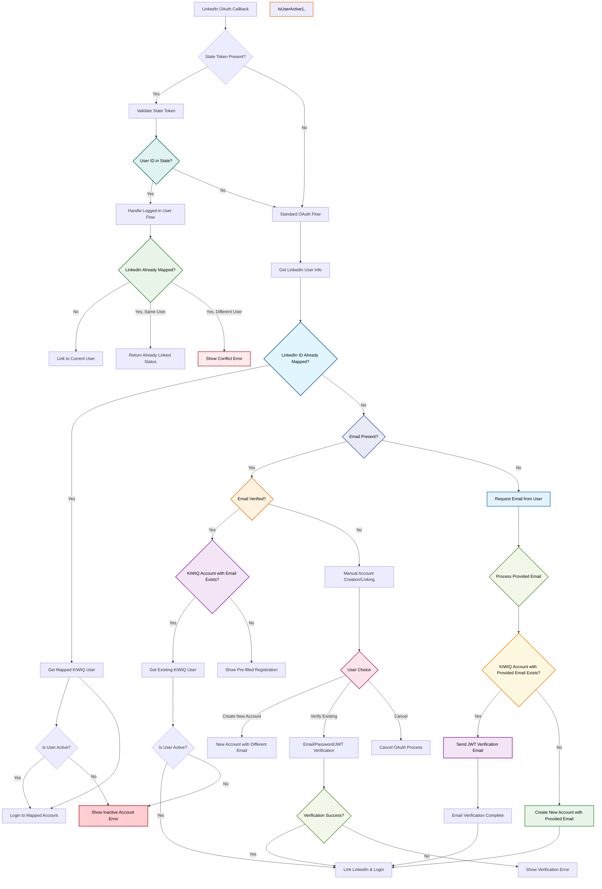
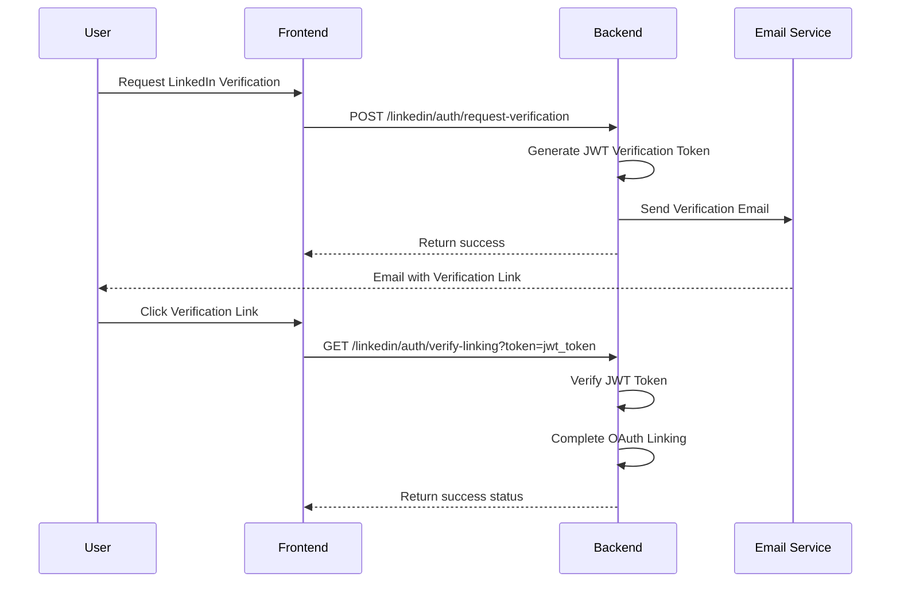
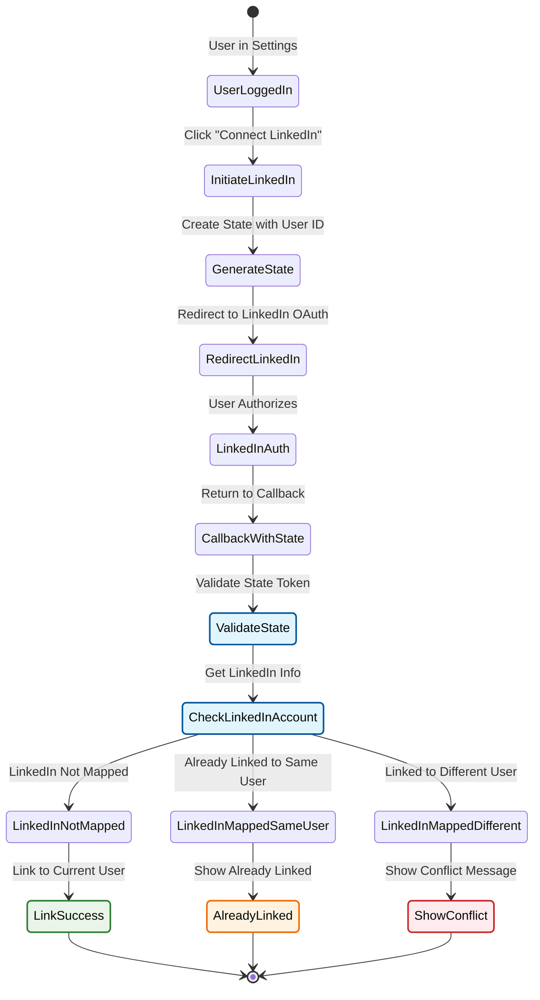
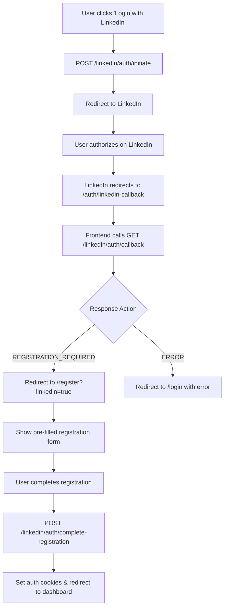
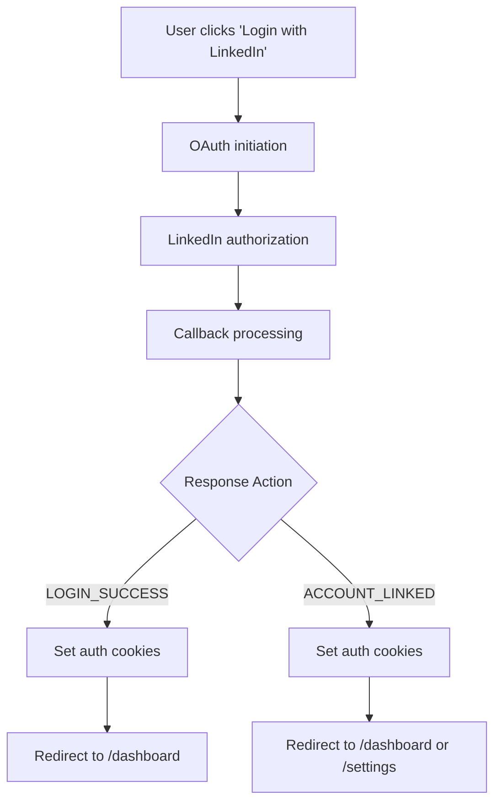
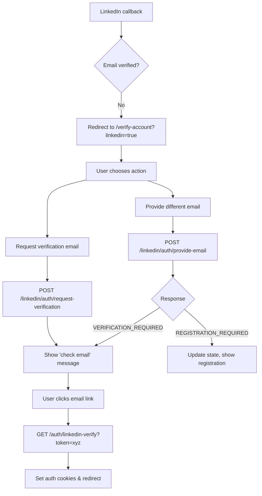
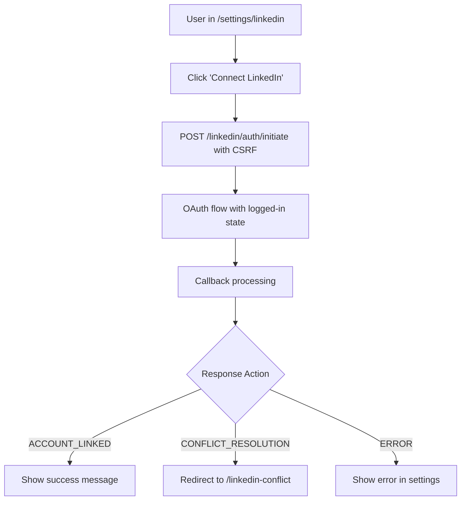
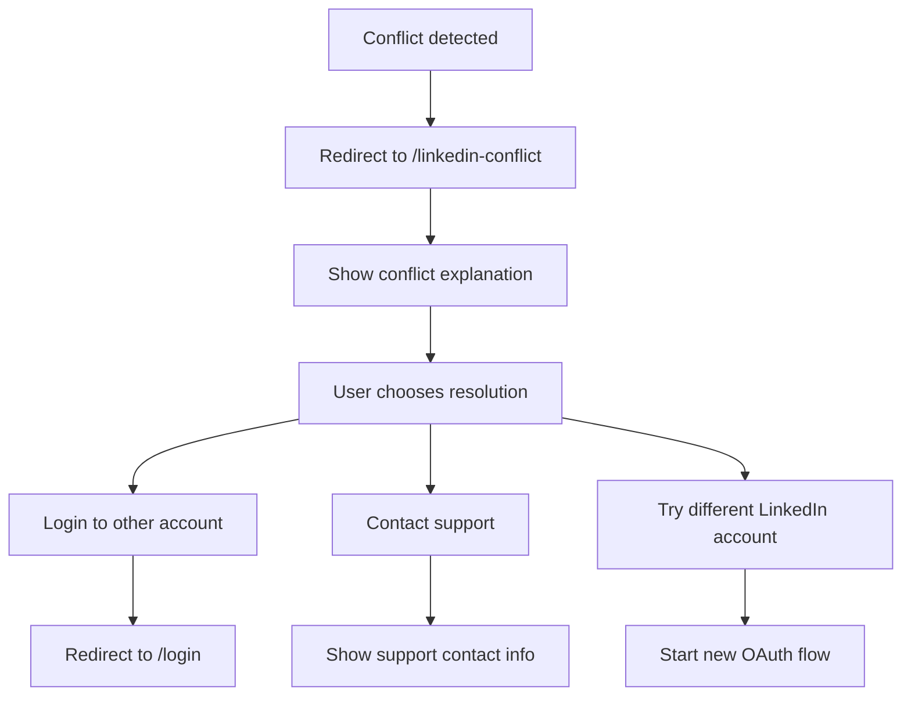

# LinkedIn OAuth Integration Design Document

## Table of Contents
1. [Overview](#overview)
2. [Architecture](#architecture)
3. [OAuth State Management](#oauth-state-management)
4. [Database Design](#database-design)
5. [OAuth Flow Diagrams](#oauth-flow-diagrams)
6. [Component Design](#component-design)
7. [API Design](#api-design)
8. [Frontend Requirements](#frontend-requirements)
9. [Frontend Architecture](#frontend-architecture)
10. [Frontend Routing & Pages](#frontend-routing--pages)
11. [Frontend User Flows](#frontend-user-flows)
12. [Frontend Error Handling](#frontend-error-handling)
13. [Security Design](#security-design)
14. [Edge Cases & Error Handling](#edge-cases--error-handling)
15. [Monitoring & Operations](#monitoring--operations)

## Overview

The LinkedIn OAuth integration enables KIWIQ users to authenticate and connect their LinkedIn accounts for seamless integration with LinkedIn features.

### Core Principles
- **Strict 1:1 Mapping**: One LinkedIn account maps to exactly one KIWIQ account (enforced via database constraints)
- **Dual Identity System**: KIWIQ uses user.id as primary identifier, LinkedIn uses Sub/ID, with account joining via shared email during OAuth
- **State-Driven Architecture**: All OAuth flows tracked through explicit state transitions
- **Token Lifecycle Management**: Automatic refresh with expiration tracking
- **Multi-Flow Support**: Handles logged-out signup/login and logged-in account linking

### Business Requirements
- Support LinkedIn-based signup for new users
- Enable LinkedIn login for existing LinkedIn-connected accounts  
- Allow existing KIWIQ users to link their LinkedIn accounts
- Handle both verified and unverified LinkedIn emails gracefully
- Provide secure token management with automatic refresh
- **Active Account Requirement**: All OAuth flows are only applicable to active KIWIQ user accounts. Inactive accounts cannot initiate or complete the linking process.
- **Automatic Email Verification**: If a user's email is verified by LinkedIn, or if they complete the manual email verification step to link accounts, their KIWIQ account will be marked as `is_verified` automatically.

## Architecture

### System Architecture
```
┌─────────────────┐     ┌──────────────────┐     ┌─────────────────┐
│                 │     │                  │     │                 │
│   Frontend      │────▶│  LinkedIn OAuth  │────▶│  LinkedIn API   │
│   Application   │     │     Service      │     │                 │
│                 │     │                  │     │                 │
└─────────────────┘     └──────────────────┘     └─────────────────┘
         │                       │
         │                       │
         ▼                       ▼
┌─────────────────┐     ┌──────────────────┐
│                 │     │                  │
│   Auth Service  │     │   Database       │
│                 │     │   (PostgreSQL)   │
│                 │     │                  │
└─────────────────┘     └──────────────────┘
```

### Service Dependencies
- **LinkedIn OAuth Service**: Core service managing OAuth flows and state transitions
- **Auth Service**: Handles user authentication, registration, and session management
- **Email Service**: Manages verification emails and OTP delivery
- **State Manager**: JWT-based state token generation and validation
- **Background Workers**: Token refresh, expiration handling, cleanup jobs

## OAuth State Management

### State Machine Design

| State | Description | Entry Conditions | Exit Conditions | Next States |
|-------|-------------|------------------|-----------------|-------------|
| PENDING | OAuth flow initiated | User starts OAuth | Callback received | ACTIVE, VERIFICATION_REQUIRED, REGISTRATION_REQUIRED, ERROR |
| VERIFICATION_REQUIRED | Email verification needed | Unverified LinkedIn email | User verifies account | ACTIVE, ERROR |
| REGISTRATION_REQUIRED | New user registration | No existing KIWIQ account | Registration completed | ACTIVE, ERROR |
| ACTIVE | Fully functional | Successful linking | Token expires, user unlinks | EXPIRED, REVOKED |
| EXPIRED | Tokens expired | Access token expires | Successful refresh | ACTIVE, ERROR |
| ERROR | Failed state | Any error condition | User retries | ACTIVE, REVOKED |
| REVOKED | Terminated connection | User unlinks, admin action | N/A | None (terminal state) |
| PENDING_DELETION | User has initiated deletion process | User action | Deletion complete | REVOKED |

### State Transition Rules
1. States are immutable - only forward transitions allowed
2. Each transition must be logged with metadata
3. ERROR state must include error details in state_metadata
4. EXPIRED state triggers automatic refresh attempts
5. Terminal states (REVOKED) cannot transition

### State Metadata Schema
```json
{
  "timestamp": "ISO-8601 timestamp",
  "trigger": "user_action|system|timeout",
  "previous_state": "state_name",
  "details": {
    // State-specific metadata
  }
}
```

## Database Design

### LinkedIn OAuth Model

**Table: linkedin_oauth**
| Column | Type | Constraints | Description |
|--------|------|-------------|-------------|
| id | VARCHAR(255) | PRIMARY KEY | LinkedIn Sub/ID |
| user_id | UUID | UNIQUE, NOT NULL, FK(users) | KIWIQ user reference |
| oauth_state | VARCHAR(50) | NOT NULL, INDEX | Current state from state machine |
| state_metadata | JSONB | NULL | State-specific metadata |
| access_token | TEXT | NOT NULL | Encrypted OAuth access token |
| refresh_token | TEXT | NULL | Encrypted OAuth refresh token |
| scope | TEXT | NOT NULL | Space-delimited permissions |
| expires_in | INTEGER | NOT NULL | Token validity in seconds |
| token_expires_at | TIMESTAMP | NULL, INDEX | Calculated expiration |
| refresh_token_expires_at | TIMESTAMP | NULL | Refresh token expiration |
| created_at | TIMESTAMP | NOT NULL | Record creation time |
| updated_at | TIMESTAMP | NOT NULL | Last update time |

**Indexes:**
- PRIMARY KEY on `id` (LinkedIn Sub)
- UNIQUE constraint on `user_id` (enforces 1:1 mapping)
- INDEX on `oauth_state` for state queries
- INDEX on `token_expires_at` for expiration queries
- INDEX on `created_at` for cleanup queries

**Database Operations:**

1. **Upsert Pattern** (create_or_update):
   - Check existence by LinkedIn ID
   - If exists: update tokens and state
   - If not exists: create new record
   - Handle unique constraint violations

2. **State Updates**:
   - Validate current state allows transition
   - Update state and metadata atomically
   - Log state transition for audit

3. **Token Refresh**:
   - Check refresh token validity
   - Update tokens and expiration
   - Handle refresh failures → EXPIRED state

4. **Bulk Operations**:
   - Mark expired tokens (batch job)
   - Clean up abandoned flows (PENDING > 24h)
   - Analytics aggregation by organization

### Token Storage Security
- Tokens encrypted using AES-256-GCM before storage
- Encryption keys rotated quarterly
- Separate key per environment
- Tokens never logged or exposed in errors

## OAuth Flow Diagrams

### 1. Main OAuth Callback Flow


### 2. LinkedIn OAuth Verification Flow


### 3. Logged-in User LinkedIn Connection Flow


### JWT Token Structure

**LinkedIn Verification Token:**
```json
{
  "sub": "user_id_uuid",
  "token_type": "linkedin_verification",
  "linkedin_id": "linkedin_sub_id",
  "oauth_data": {
    "access_token": "encrypted_linkedin_token",
    "refresh_token": "encrypted_refresh_token",
    "scope": "r_liteprofile r_emailaddress",
    "expires_in": 3600
  },
  "exp": "expiration_timestamp",
  "iat": "issued_at_timestamp"
}
```

**Token Validation Process:**
1. Verify JWT signature using SECRET_KEY
2. Check token expiration
3. Validate token_type == "linkedin_verification"
4. Extract user_id from subject
5. Extract LinkedIn OAuth data from claims
6. Complete OAuth linking process

## Component Design

### 1. LinkedIn OAuth Service
**Purpose**: Core business logic for OAuth flows

**Key Responsibilities:**
- Process OAuth callbacks with state validation
- Handle different user scenarios (new/existing/logged-in)
- Manage state transitions with proper validation
- Coordinate with Auth Service for user operations
- Token refresh orchestration

**Interface Design:**
| Method | Purpose | Input | Output |
|--------|---------|-------|--------|
| process_oauth_callback | Main OAuth handler | code, state | OauthCallbackResult |
| complete_registration | Finalize new user | user data, state token | User, OAuth record |
| handle_missing_email | Process user-provided email | email, state token | EmailHandlingResult |
| send_verification_email | Send JWT verification | email, oauth data | Verification token |
| verify_linking_token | Complete linking via JWT | jwt token | User, OAuth record |
| refresh_access_token | Refresh expired token | user_id | New tokens |
| unlink_account | Remove LinkedIn connection | user_id | Success boolean |

### 2. LinkedIn OAuth DAO
**Purpose**: Data access layer for OAuth records

**Key Operations:**
1. **create_or_update**: Atomic upsert with state management
2. **update_state**: State transition with validation
3. **get_by_state**: Query records in specific states
4. **mark_expired_tokens**: Batch expiration handling
5. **get_organization_connections**: Analytics queries

**Transaction Patterns:**
- All writes use explicit transactions
- State transitions use row-level locking
- Bulk operations use batch processing
- Read queries use appropriate isolation levels

### 3. State Manager
**Purpose**: JWT-based state token management

**Token Types:**
1. **OAuth State Token**
   - Contains: `user_id` (optional), `csrf_token`, `timestamp`, `redirect_uri`
   - Expiry: 10 minutes
   - Used for: OAuth flow CSRF protection and ensuring `redirect_uri` consistency.

2. **Session Token**
   - Contains: linkedin_id, email, name, tokens
   - Expiry: 30 minutes
   - Used for: Incomplete flow data storage

3. **Verification Token**
   - Contains: user_id, linkedin_id, oauth_data, timestamp
   - Expiry: 30 minutes
   - Used for: LinkedIn OAuth linking verification

**Security Features:**
- JWT with HMAC-SHA256 signing
- Timestamp validation and expiration
- Token type validation (linkedin_verification)
- Secure subject (user_id) encoding

## API Design

### Public Endpoints

| Endpoint | Method | Purpose | Request | Response |
|----------|--------|---------|---------|----------|
| /linkedin/auth/initiate | GET | Start OAuth flow | redirect_url (optional) | { authorization_url, state } |
| /linkedin/auth/callback | GET | OAuth callback | code, state, error | Redirect with cookies |
| /linkedin/auth/complete-registration | POST | New user signup | { state_token, user_data } | { access_token, user } |
| /linkedin/auth/link-existing | POST | Link existing account | { state_token, credentials } | { access_token, user } |
| /linkedin/auth/validate-state | POST | Check state token | { state_token } | { valid, data } |
| /linkedin/auth/request-verification | POST | Request verification | { email, state_token } | { success, expires_in } |
| /linkedin/auth/verify-linking | GET | Verify linking | token | { success, status } |
| /linkedin/auth/provide-email | POST | Provide missing email | { email, state_token } | { success, requires_verification } |

### Protected Endpoints

| Endpoint | Method | Purpose | Request | Response |
|----------|--------|---------|---------|----------|
| /linkedin/me/connection | GET | Get status | - | { is_connected, details } |
| /linkedin/me/unlink | DELETE | Unlink | { confirm: true } | 204 No Content |
| /linkedin/me/refresh-token | POST | Force refresh | - | { success, expires_in } |
| /linkedin/me/sync-profile | POST | Sync profile | { fields[] } | { updated_fields } |

### Response Patterns
```json
// Success Response
{
  "success": true,
  "data": { ... },
  "metadata": {
    "timestamp": "ISO-8601",
    "request_id": "uuid"
  }
}

// Error Response
{
  "success": false,
  "error": {
    "code": "LINKEDIN_ACCOUNT_CONFLICT",
    "message": "User-friendly message",
    "details": { ... },
    "actions": ["unlink_other_account", "use_different_linkedin"]
  },
  "metadata": { ... }
}
```

## Frontend Requirements

### Core Frontend Responsibilities
- **Multi-Flow Support**: Handle both logged-out OAuth flows (login/signup) and logged-in flows (account linking)
- **State Management**: Manage OAuth state cookies and CSRF tokens across browser sessions
- **Response Processing**: Parse OAuth callback responses and route users to appropriate next steps
- **Error Handling**: Gracefully handle all error scenarios with user-friendly messages
- **Security**: Validate CSRF tokens and manage secure cookie handling
- **User Experience**: Provide clear feedback and guidance through complex OAuth flows

### Frontend Technology Requirements
- **Cookie Management**: Handle secure, httpOnly cookies for OAuth state and CSRF tokens
- **URL Parsing**: Extract query parameters from OAuth callbacks and verification links
- **Form Handling**: Manage registration, linking, and email provision forms
- **API Integration**: Make authenticated API calls with proper CSRF protection
- **State Persistence**: Maintain user flow context across page refreshes and redirects

## Frontend Architecture

### State Management Strategy
```typescript
interface LinkedInOAuthState {
  // Current flow state
  currentFlow: 'logged-out' | 'logged-in' | 'verification' | 'registration';
  isLoading: boolean;
  error: string | null;
  
  // User information from OAuth
  userInfo?: {
    email?: string;
    name?: string;
    linkedin_id?: string;
    existing_account_email?: string;
  };
  
  // Flow-specific data
  requiresAction: boolean;
  actionType?: OauthAction;
  redirectUrl?: string;
}
```

### Component Architecture
```
Frontend LinkedIn OAuth Components
├── LinkedInAuthButton (initiate OAuth)
├── LinkedInCallbackHandler (process callbacks)
├── LinkedInRegistrationForm (complete registration)
├── LinkedInLinkingForm (link existing account)
├── LinkedInVerificationPage (email verification)
├── LinkedInConflictResolver (handle conflicts)
├── LinkedInSettings (manage connection)
├── EmailProvisionForm (provide missing email)
└── LinkedInStatusIndicator (show connection status)
```

### Cookie & Security Handling
```typescript
class LinkedInOAuthManager {
  // CSRF token management
  private getCSRFToken(): string;
  private setCSRFHeader(request: Request): void;
  
  // OAuth state management  
  private handleOAuthCallback(params: URLSearchParams): Promise<void>;
  private processCallbackResponse(response: OauthCallbackResponse): void;
  
  // API calls with security
  private makeSecureRequest(endpoint: string, data?: any): Promise<Response>;
}
```

## Frontend Routing & Pages

### Route Structure
| Route | Component | Purpose | Access |
|-------|-----------|---------|--------|
| `/login` | LoginPage | Main login page with LinkedIn button | Public |
| `/register` | RegisterPage | Registration page with LinkedIn option | Public |
| `/auth/linkedin-callback` | LinkedInCallbackHandler | Process OAuth callbacks | Public |  
| `/auth/linkedin-verify` | LinkedInVerificationPage | Email verification flow | Public |
| `/register?linkedin=true` | LinkedInRegistrationForm | Complete LinkedIn registration | Public |
| `/verify-account?linkedin=true` | LinkedInAccountVerification | Verify account for linking | Public |
| `/linkedin-conflict` | LinkedInConflictPage | Resolve account conflicts | Public |
| `/settings/linkedin` | LinkedInSettingsPage | Manage LinkedIn connection | Private |
| `/dashboard` | Dashboard | Post-login destination | Private |

### Page Components & Responsibilities

#### 1. LoginPage (`/login`)
**Purpose**: Main entry point for LinkedIn authentication
```typescript
interface LoginPageProps {
  error?: string; // URL param for OAuth errors
  message?: string; // URL param for error messages
}

// Responsibilities:
// - Display LinkedIn login button
// - Handle OAuth initiation
// - Show OAuth error messages
// - Redirect authenticated users
```

#### 2. LinkedInCallbackHandler (`/auth/linkedin-callback`)
**Purpose**: Process OAuth callback from LinkedIn
```typescript
interface CallbackParams {
  code?: string;
  state?: string;
  error?: string;
  error_description?: string;
}

// Responsibilities:
// - Extract callback parameters
// - Call backend callback endpoint
// - Process OauthCallbackResponse
// - Redirect based on action type
// - Handle authentication cookie setting
```

#### 3. LinkedInRegistrationForm (`/register?linkedin=true`)
**Purpose**: Complete registration for new LinkedIn users
```typescript
interface RegistrationFormState {
  fullName: string;
  email: string;
  organizationName?: string;
  agreeToTerms: boolean;
  isSubmitting: boolean;
}

// Responsibilities:
// - Pre-populate form from LinkedIn data
// - Validate registration data
// - Submit registration with CSRF protection
// - Handle registration completion
// - Set authentication cookies
```

#### 4. LinkedInAccountVerification (`/verify-account?linkedin=true`)
**Purpose**: Handle account verification scenarios
```typescript
interface VerificationPageState {
  email?: string; // Pre-filled from LinkedIn
  action: 'request-verification' | 'provide-email' | 'link-existing';
  isLoading: boolean;
}

// Responsibilities:
// - Request verification email for unverified LinkedIn email
// - Allow manual email provision
// - Handle existing account linking
// - Show appropriate verification UI
```

#### 5. LinkedInConflictPage (`/linkedin-conflict`)
**Purpose**: Resolve LinkedIn account conflicts
```typescript
interface ConflictPageProps {
  email?: string; // Conflicting account email
  linkedin_id?: string; // LinkedIn ID in conflict
}

// Responsibilities:
// - Explain conflict situation
// - Provide resolution options
// - Guide user to appropriate actions
// - Link to other account login
```

#### 6. LinkedInVerificationPage (`/auth/linkedin-verify`)
**Purpose**: Handle email verification link clicks
```typescript
interface VerificationPageProps {
  token: string; // JWT from email link
}

// Responsibilities:
// - Extract verification token from URL
// - Call verification endpoint
// - Handle successful linking
// - Set authentication cookies
// - Redirect to appropriate destination
```

#### 7. LinkedInSettingsPage (`/settings/linkedin`)
**Purpose**: Manage LinkedIn connection for logged-in users
```typescript
interface LinkedInSettingsState {
  connectionStatus: LinkedinConnectionStatus;
  isLinking: boolean;
  isUnlinking: boolean;
  isRefreshing: boolean;
}

// Responsibilities:
// - Show current connection status
// - Initiate LinkedIn linking
// - Handle account unlinking
// - Refresh expired tokens
// - Show connection history
```

## Frontend User Flows

### 1. New User LinkedIn Registration Flow


### 2. Existing User LinkedIn Login Flow


### 3. Email Verification Flow


### 4. Logged-in User Linking Flow


### 5. Account Conflict Resolution Flow


## Frontend Error Handling

### Error Categories & UI Responses

#### 1. OAuth Authorization Errors
**Scenarios**: User denies LinkedIn permission, LinkedIn API errors
```typescript
interface OAuthError {
  error: 'access_denied' | 'server_error' | 'temporarily_unavailable';
  error_description?: string;
}

// UI Response:
// - Show user-friendly error message
// - Provide 'Try Again' button
// - Explain what went wrong
// - Offer alternative login methods
```

#### 2. Network & API Errors
**Scenarios**: Backend API failures, network connectivity issues
```typescript
// UI Response:
// - Show "Something went wrong" message
// - Provide retry mechanism
// - Show loading states appropriately
// - Fall back to manual email/password login
```

#### 3. State Token Errors
**Scenarios**: CSRF validation failures, expired state tokens
```typescript
// UI Response:
// - Clear OAuth state
// - Restart OAuth flow
// - Show "Security validation failed" message
// - Redirect to clean login page
```

#### 4. Account Conflict Errors
**Scenarios**: LinkedIn account already linked elsewhere
```typescript
// UI Response:
// - Redirect to conflict resolution page
// - Show clear explanation of conflict
// - Provide resolution options
// - Show conflicting account email (partial)
```

#### 5. Validation Errors
**Scenarios**: Invalid form data, missing required fields
```typescript
// UI Response:
// - Show field-level validation errors
// - Highlight invalid fields
// - Prevent form submission
// - Provide clear correction guidance
```

### Error Response Processing
```typescript
class LinkedInErrorHandler {
  handleCallbackError(response: OauthCallbackResponse): void {
    switch (response.error_code) {
      case 'linkedin_oauth_failed':
        this.showOAuthError(response.message);
        break;
      case 'account_conflict':
        this.redirectToConflictPage(response.user_info);
        break;
      case 'missing_code':
        this.restartOAuthFlow();
        break;
      case 'internal_error':
        this.showGenericError();
        break;
      default:
        this.showUnknownError(response.message);
    }
  }
  
  handleAPIError(error: APIError): void {
    if (error.status === 401) {
      this.handleAuthenticationError();
    } else if (error.status === 409) {
      this.handleConflictError(error.detail);
    } else if (error.status >= 500) {
      this.showServerError();
    } else {
      this.showValidationError(error.detail);
    }
  }
}
```

### User Experience Guidelines

#### Loading States
- Show loading indicators during OAuth flows
- Disable buttons during API calls
- Provide progress feedback for multi-step flows
- Handle slow network connections gracefully

#### Success Messaging
- Show clear success messages after account linking
- Provide confirmation of completed actions
- Guide users to next steps
- Highlight newly available features

#### Error Recovery
- Always provide a way to restart the flow
- Offer alternative authentication methods
- Show helpful troubleshooting tips
- Provide support contact information

#### Security Messaging
- Explain why email verification is required
- Show security benefits of LinkedIn linking
- Clarify data sharing and permissions
- Provide privacy policy links

### Frontend API Integration

#### Required API Calls
```typescript
interface LinkedInOAuthAPI {
  // OAuth flow initiation
  initiateOAuth(redirectUrl?: string): Promise<LinkedInInitiateResponse>;
  
  // Registration completion
  completeRegistration(data: CompleteLinkedinRegistration): Promise<void>;
  
  // Account linking
  linkExistingAccount(data: LinkExistingAccount): Promise<void>;
  
  // Email verification
  requestVerification(): Promise<void>;
  provideEmail(email: string): Promise<ProvideEmailResult>;
  
  // Connection management
  getConnectionStatus(): Promise<LinkedinConnectionStatus>;
  unlinkAccount(): Promise<void>;
  refreshToken(): Promise<LinkedinConnectionStatus>;
}
```

#### CSRF Token Handling
```typescript
class CSRFManager {
  getToken(): string | null {
    return this.getCookie('XSRF-TOKEN');
  }
  
  setRequestHeader(headers: Headers): void {
    const token = this.getToken();
    if (token) {
      headers.set('X-XSRF-TOKEN', token);
    }
  }
  
  private getCookie(name: string): string | null {
    // Extract cookie value
  }
}
```

#### Cookie Management
```typescript
class CookieManager {
  // OAuth state cookies are httpOnly and managed by backend
  // CSRF tokens are readable by JavaScript
  
  hasAuthCookies(): boolean {
    // Check for presence of auth cookies
    return document.cookie.includes('access_token');
  }
  
  clearOAuthState(): void {
    // OAuth state cookies are cleared by backend
    // Just trigger re-authentication if needed
  }
}
```

### Mobile & Responsive Considerations

#### Mobile OAuth Flow
- Handle mobile browser peculiarities
- Account for app switching (LinkedIn app vs browser)
- Manage focus return after authorization
- Handle keyboard and viewport changes

#### Responsive Design
- Optimize forms for mobile input
- Ensure buttons are touch-friendly
- Handle portrait/landscape orientation
- Provide appropriate spacing and sizing

#### Progressive Enhancement
- Work without JavaScript (basic forms)
- Enhance with JavaScript for better UX
- Handle JavaScript loading failures
- Provide fallback authentication methods

### Frontend-Backend Integration

#### API Endpoint Mapping
| Frontend Action | Backend Endpoint | Method | Purpose |
|----------------|------------------|--------|---------|
| Initiate OAuth | `/api/v1/linkedin/auth/initiate` | GET | Start OAuth flow |
| Process Callback | `/api/v1/linkedin/auth/callback` | GET | Handle LinkedIn callback |
| Complete Registration | `/api/v1/linkedin/auth/complete-registration` | POST | Finish new user signup |
| Link Existing Account | `/api/v1/linkedin/auth/link-existing` | POST | Link to existing account |
| Request Verification | `/api/v1/linkedin/auth/request-verification` | POST | Send verification email |
| Verify Linking | `/api/v1/linkedin/auth/verify-linking` | GET | Verify email link |
| Provide Email | `/api/v1/linkedin/auth/provide-email` | POST | Manual email provision |
| Get Connection Status | `/api/v1/linkedin/me/connection` | GET | Check link status |
| Unlink Account | `/api/v1/linkedin/me/unlink` | DELETE | Remove LinkedIn link |
| Refresh Token | `/api/v1/linkedin/me/refresh-token` | POST | Refresh access token |

#### URL Parameter Handling
```typescript
// OAuth Callback Parameters
interface OAuthCallbackParams {
  code?: string;          // Authorization code from LinkedIn
  state?: string;         // State token for CSRF protection
  error?: string;         // OAuth error code
  error_description?: string; // Error details
}

// Verification Link Parameters
interface VerificationParams {
  token: string;          // JWT verification token
}

// Error Redirect Parameters
interface ErrorParams {
  error?: string;         // Error type
  message?: string;       // Error message
  email?: string;         // Related email address
}
```

#### Environment-Specific Routing
```typescript
class LinkedInRouteConfig {
  private isProd = process.env.NODE_ENV === 'production';
  
  get callbackUrl(): string {
    return this.isProd 
      ? 'https://beta.kiwiq.ai/auth/linkedin-callback'
      : 'http://localhost:3000/auth/linkedin-callback';
  }
  
  get apiBaseUrl(): string {
    return this.isProd
      ? 'https://api.kiwiq.ai/api/v1'
      : 'http://localhost:8000/api/v1';
  }
  
  get redirectUrls(): RedirectUrlConfig {
    return {
      login: this.isProd ? 'https://beta.kiwiq.ai/login' : 'http://localhost:3000/login',
      register: this.isProd ? 'https://beta.kiwiq.ai/register' : 'http://localhost:3000/register',
      dashboard: this.isProd ? 'https://beta.kiwiq.ai/dashboard' : 'http://localhost:3000/dashboard',
      settings: this.isProd ? 'https://beta.kiwiq.ai/settings' : 'http://localhost:3000/settings',
      conflict: this.isProd ? 'https://beta.kiwiq.ai/linkedin-conflict' : 'http://localhost:3000/linkedin-conflict',
      verify: this.isProd ? 'https://beta.kiwiq.ai/verify-account' : 'http://localhost:3000/verify-account',
      linkedinVerify: this.isProd ? 'https://beta.kiwiq.ai/auth/linkedin-verify' : 'http://localhost:3000/auth/linkedin-verify',
    };
  }
}
```

#### State Management Integration
```typescript
// React Context or Zustand Store
interface LinkedInOAuthStore {
  // State
  isAuthenticated: boolean;
  currentUser: User | null;
  linkedInConnection: LinkedinConnectionStatus | null;
  oauthState: LinkedInOAuthState;
  
  // Actions
  initiateOAuth: () => Promise<void>;
  processCallback: (params: OAuthCallbackParams) => Promise<void>;
  completeRegistration: (data: CompleteLinkedinRegistration) => Promise<void>;
  linkExistingAccount: (data: LinkExistingAccount) => Promise<void>;
  requestVerification: () => Promise<void>;
  provideEmail: (email: string) => Promise<void>;
  verifyLinking: (token: string) => Promise<void>;
  
  // Connection management
  getConnectionStatus: () => Promise<void>;
  unlinkAccount: () => Promise<void>;
  refreshToken: () => Promise<void>;
  
  // Utility actions
  clearOAuthState: () => void;
  setError: (error: string) => void;
  setLoading: (loading: boolean) => void;
}
```

#### Router Integration Examples

##### React Router Setup
```typescript
// App routing configuration
const linkedInRoutes: RouteObject[] = [
  {
    path: '/auth/linkedin-callback',
    element: <LinkedInCallbackHandler />,
  },
  {
    path: '/auth/linkedin-verify',
    element: <LinkedInVerificationPage />,
  },
  {
    path: '/register',
    element: <RegisterPage />,
  },
  {
    path: '/verify-account',
    element: <LinkedInAccountVerification />,
  },
  {
    path: '/linkedin-conflict',
    element: <LinkedInConflictPage />,
  },
  {
    path: '/settings/linkedin',
    element: <ProtectedRoute><LinkedInSettingsPage /></ProtectedRoute>,
  },
];
```

##### Next.js Pages Router
```typescript
// pages/auth/linkedin-callback.tsx
export default function LinkedInCallback() {
  return <LinkedInCallbackHandler />;
}

// pages/auth/linkedin-verify.tsx
export default function LinkedInVerify() {
  return <LinkedInVerificationPage />;
}

// pages/register.tsx
export default function Register() {
  return <RegisterPage />;
}
```

##### Next.js App Router
```typescript
// app/auth/linkedin-callback/page.tsx
export default function LinkedInCallbackPage() {
  return <LinkedInCallbackHandler />;
}

// app/auth/linkedin-verify/page.tsx
export default function LinkedInVerifyPage() {
  return <LinkedInVerificationPage />;
}
```

#### Testing Strategy

##### Component Testing
```typescript
// Test OAuth initiation
test('initiates LinkedIn OAuth flow', async () => {
  const mockInitiate = jest.fn();
  render(<LinkedInAuthButton onInitiate={mockInitiate} />);
  
  fireEvent.click(screen.getByText('Login with LinkedIn'));
  expect(mockInitiate).toHaveBeenCalled();
});

// Test callback handling
test('processes OAuth callback correctly', async () => {
  const mockCallback = jest.fn();
  render(<LinkedInCallbackHandler onCallback={mockCallback} />);
  
  // Simulate callback with code
  expect(mockCallback).toHaveBeenCalledWith({
    code: 'auth_code',
    state: 'state_token'
  });
});
```

##### Integration Testing
```typescript
// Test complete OAuth flow
test('completes LinkedIn registration flow', async () => {
  // Mock API responses
  const mockAPI = {
    initiateOAuth: jest.fn().mockResolvedValue({ authorization_url: 'https://linkedin.com/oauth' }),
    completeRegistration: jest.fn().mockResolvedValue({ status: 'success' }),
  };
  
  // Test flow
  await mockAPI.initiateOAuth();
  await mockAPI.completeRegistration({
    fullName: 'John Doe',
    email: 'john@example.com',
    agreeToTerms: true,
  });
  
  expect(mockAPI.completeRegistration).toHaveBeenCalled();
});
```

##### E2E Testing
```typescript
// Playwright/Cypress test
test('LinkedIn OAuth flow end-to-end', async ({ page }) => {
  // Navigate to login page
  await page.goto('/login');
  
  // Click LinkedIn login button
  await page.click('[data-testid="linkedin-login-button"]');
  
  // Handle LinkedIn authorization (mock or real)
  // ... LinkedIn OAuth steps ...
  
  // Verify successful login
  await expect(page).toHaveURL('/dashboard');
  await expect(page.locator('[data-testid="user-name"]')).toBeVisible();
});
```

## Security Design

### Token Security
1. **Storage Security**
   - AES-256-GCM encryption at rest
   - Separate encryption keys per token type
   - Key rotation every 90 days
   - Hardware security module (HSM) in production

2. **Transport Security**
   - TLS 1.3 minimum
   - Certificate pinning for mobile apps
   - Secure cookie attributes (httpOnly, secure, sameSite=strict)

3. **Token Lifecycle**
   - Access tokens: 60-day expiry (LinkedIn default)
   - Refresh tokens: 365-day expiry
   - Automatic refresh 24 hours before expiry
   - Revocation on suspicious activity

### Authentication Security
1. **CSRF Protection**
   - State parameter validation
   - Double-submit cookie pattern
   - Origin header validation

2. **Session Security**
   - JWT session tokens with short expiry
   - Secure session storage
   - IP address validation (optional)
   - Device fingerprinting

3. **Rate Limiting**
   - OAuth initiate: 10/minute per IP
   - OAuth callback: 20/minute per IP
   - Verification request: 5/minute per email
   - Progressive backoff on failures

### Access Control
1. **1:1 Mapping Enforcement**
   - Database unique constraint on user_id
   - Application-level validation
   - Conflict resolution workflow

2. **Organization Isolation**
   - Tenant-based data separation
   - Row-level security policies
   - Cross-tenant access prevention

## Edge Cases & Error Handling

### Scenario-Based Design

#### 1. Direct Login (LinkedIn Already Mapped)
**Flow:**
- LinkedIn ID exists in database
- Retrieve associated KIWIQ user
- Update tokens and expiration
- Set oauth_state to ACTIVE
- Create auth session

**Database Operations:**
- SELECT by LinkedIn ID
- UPDATE tokens and timestamps
- UPDATE oauth_state to ACTIVE
- Log successful login

#### 2. Auto-Link (Verified Email Match)
**Flow:**
- LinkedIn email verified
- Check for existing KIWIQ account
- If exists: check if active, then link, mark as verified, and login
- If not: show pre-filled registration

**Database Operations:**
- SELECT user by email
- UPDATE user set is_verified=true
- INSERT/UPDATE OAuth record
- Set oauth_state to ACTIVE
- Create audit log entry

#### 3. Manual Verification Required
**Flow:**
- LinkedIn email unverified or no KIWIQ account match
- Create session token with OAuth data
- Send JWT verification email (similar to account verification)
- Set oauth_state to VERIFICATION_REQUIRED

**JWT Verification Process:**
- Generate JWT token with type "linkedin_verification"
- Token contains: user_id, linkedin_id, oauth_data
- Email sent with verification link containing JWT
- User clicks link to complete OAuth linking, which also marks the user's email as verified in the KIWIQ system
- Does NOT log user in, only completes linking

#### 4. Logged-in User Linking
**Flow:**
- User initiates from settings
- State token includes user_id and redirect_uri
- After callback, backend retrieves LinkedIn info
- Backend checks if the LinkedIn account is already mapped to another KIWIQ user.
  - If it is, an explicit `AccountConflictException` is raised and a 409 error is returned to the user, preventing the linking.
  - If not, the account is linked to the current user.
- If the current user already has a *different* LinkedIn account linked, the old one is unlinked first.

**Conflict Resolution:**
- **Logged-in flow:** If the target LinkedIn account is already linked to a different KIWIQ user, the operation fails with a 409 Conflict error. The user must resolve this manually (e.g., by logging into the other account and unlinking).
- **Logged-out flow:** If the user's verified email matches a KIWIQ account that is already linked to a different LinkedIn account, the user is shown a conflict message and must resolve it manually.

#### 5. Missing Email Address Handling
**Flow:**
- LinkedIn profile has no email address
- Present email collection form to user
- User provides email address manually
- Check if KIWIQ account exists with provided email

**Database Operations:**
- Check email existence in KIWIQ database
- If exists: Send JWT verification email
- If not exists: Create new account with LinkedIn linking
- Update oauth_state to VERIFICATION_REQUIRED or ACTIVE

**Verification Process:**
- JWT verification email sent to provided address
- User clicks link to complete OAuth linking
- Email verification proves ownership
- OAuth state updated to ACTIVE upon success

#### 6. Token Expiration Handling
**Flow:**
- Detect expired access token
- Check refresh token validity
- Attempt automatic refresh
- Update oauth_state based on result

**States:**
- Success: Remain ACTIVE
- Refresh token expired: Set EXPIRED
- API error: Set ERROR with details

### Error Categories

| Error Type | Handling Strategy | User Action | System Action |
|------------|------------------|-------------|---------------|
| Network Error | Retry with backoff | Show retry button | Log and monitor |
| Invalid State | Clear and restart | Restart OAuth flow | Invalidate state |
| Account Conflict | Show resolution UI | Choose account | Log conflict |
| Token Expired | Auto-refresh | None (transparent) | Update tokens |
| API Error | Show specific message | Contact support | Alert on-call |

## Monitoring & Operations

### Key Metrics
1. **OAuth Funnel**
   - Initiation rate
   - Callback success rate
   - Registration completion rate
   - Drop-off analysis by step

2. **Token Health**
   - Active connections count
   - Token refresh success rate
   - Expiration distribution
   - Error rate by type

3. **Performance**
   - OAuth callback latency (p50, p95, p99)
   - Database query performance
   - LinkedIn API response times
   - Token refresh duration

### Operational Procedures

#### Background Jobs
1. **Token Expiration Checker** (Hourly)
   - Query tokens expiring in next 48 hours
   - Attempt refresh for active users
   - Mark failed refreshes as EXPIRED
   - Send notification emails

2. **Abandoned Flow Cleanup** (Daily)
   - Find PENDING states > 24 hours old
   - Mark as EXPIRED with reason
   - Clean up session tokens and JWT verification tokens
   - Generate abandonment report

3. **Analytics Aggregation** (Daily)
   - Calculate OAuth conversion rates
   - Aggregate by organization
   - Generate usage reports
   - Update dashboards

#### Alerts & Monitoring
1. **Critical Alerts**
   - OAuth callback error rate > 5%
   - Token refresh failure rate > 10%
   - Database connection pool exhaustion
   - LinkedIn API downtime

2. **Warning Alerts**
   - Increased latency (> 2s p95)
   - High abandonment rate (> 30%)
   - Token expiration backlog
   - State transition anomalies

### Disaster Recovery
1. **Token Compromise**
   - Immediate revocation capability
   - Bulk token invalidation
   - Force re-authentication
   - Audit trail generation

2. **Data Recovery**
   - Point-in-time recovery for OAuth records
   - Transaction log replay capability
   - Cross-region replication
   - Regular backup testing

## Future Enhancements

1. **Multi-Provider OAuth**
   - Abstract OAuth provider interface
   - Support Google, GitHub, Twitter
   - Unified token management
   - Provider-specific features

2. **Advanced Features**
   - LinkedIn profile data sync
   - Team-based connection sharing  
   - LinkedIn API proxy service
   - Webhook integration for real-time updates
