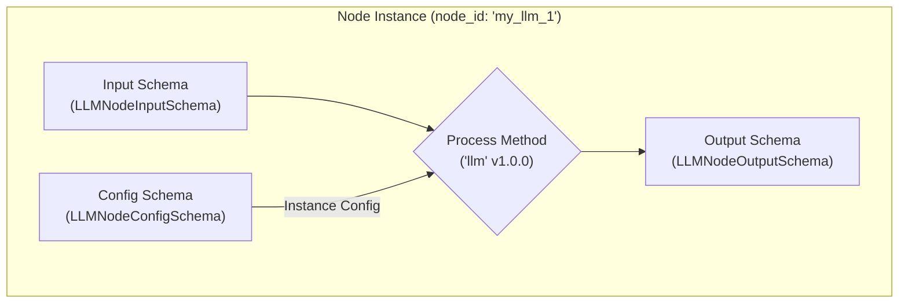
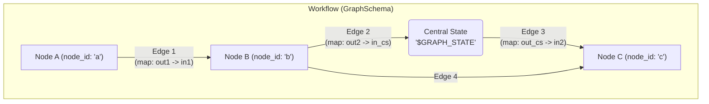
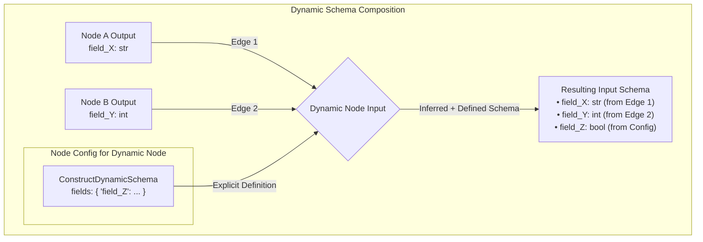

# Anatomy of Nodes and Workflows

This document provides a semi-technical overview of the fundamental building blocks of the workflow system: Nodes and Workflows. It's intended for both product managers and engineers who need to understand, build, or utilize workflows.

## 1. Anatomy of a Node

A Node is the basic unit of computation within a workflow. It encapsulates a specific piece of logic, taking defined inputs, processing them according to its configuration, and producing defined outputs.

### 1.1 Core Components (Based on `BaseNode`)

Every node in the system inherits from the `BaseNode` class (`services/workflow_service/registry/nodes/core/base.py`), which defines the core structure:

*   **`node_name` (ClassVar[str])**: A *unique* string identifier for the *type* of node (e.g., "llm", "prompt_constructor"). This is crucial for the registry to identify the node's implementation.
*   **`node_version` (ClassVar[str])**: A version string (e.g., "1.0.0") for the node's implementation, allowing for version management and compatibility checks.
*   **`input_schema_cls` (ClassVar[Type[InputSchemaT]])**: Defines the expected structure and types of data the node receives as input. It references a Pydantic `BaseSchema` subclass. Can be `None` if the node takes no input or uses a dynamic schema.
*   **`output_schema_cls` (ClassVar[Type[OutputSchemaT]])**: Defines the structure and types of data the node produces as output. It also references a Pydantic `BaseSchema` subclass. Can be `None` if the node produces no standard output (e.g., an output node) or uses a dynamic schema.
*   **`config_schema_cls` (ClassVar[Type[ConfigSchemaT]])**: Defines the configurable parameters that control the node's behavior during workflow execution. This also references a `BaseSchema` subclass. Can be `None` if the node has no configuration.
*   **`process` (abstract method)**: The core logic of the node resides here. This method takes the validated `input_data` (conforming to `input_schema_cls`) and runtime `config`, performs its computation, and returns the `output_data` (conforming to `output_schema_cls`).
*   **`node_id` (str)**: A *unique* identifier for a specific *instance* of a node within a particular workflow graph. This distinguishes between multiple nodes of the same type in a single workflow.
*   **`config` (Optional[ConfigSchemaT | Dict])**: The actual configuration values provided for this specific node instance within a workflow, validated against `config_schema_cls`.



### 1.2 Other Important Aspects

*   **Metadata**: Nodes have class variables like `env_flag` (e.g., `DEVELOPMENT`, `PRODUCTION`) to indicate their stability and intended use environment.
*   **Schema Validation**: Pydantic schemas ensure that input, output, and configuration data adhere to the expected structure and types, providing robustness.
*   **Dynamic Schemas**: Some nodes (`BaseDynamicNode`) can have their input, output, or config schemas defined or inferred at runtime, offering flexibility. (See Section 4).

## 2. Anatomy of a Workflow

A Workflow orchestrates the execution of multiple interconnected Nodes to achieve a larger goal. It defines the structure, data flow, and configuration of these nodes.

### 2.1 Core Components (Based on `GraphSchema`)

The structure of a workflow is defined by the `GraphSchema` (`services/workflow_service/graph/graph.py`):

*   **`nodes` (Dict[str, NodeConfig])**: A dictionary where keys are the unique `node_id`s (instance identifiers) and values are `NodeConfig` objects.
    *   **`NodeConfig`**: Specifies the instance details for a node within the graph:
        *   `node_id`: The unique instance ID (matching the key in the `nodes` dict).
        *   `node_name`: The type of the node (referencing the registered `node_name`).
        *   `node_version`: (Optional) Specific version to use.
        *   `node_config`: A dictionary containing the configuration values for *this specific instance*, conforming to the node type's `config_schema_cls`.
        *   `dynamic_input/output/config_schema`: (Optional) Allows defining schemas dynamically *for this specific instance* using `ConstructDynamicSchema`, often used for Input/Output/Router nodes.
        *   `enable_node_fan_in`: (Optional[bool], default=False) Controls behavior when multiple edges point *to* this node. See Section 8.
*   **`edges` (List[EdgeSchema])**: A list defining the connections *between* nodes.
    *   **`EdgeSchema`**: Specifies a directed connection:
        *   `src_node_id`: The ID of the node where data originates. Can also be the special `GRAPH_STATE_SPECIAL_NODE_NAME` to read from central state.
        *   `dst_node_id`: The ID of the node receiving the data. Can also be `GRAPH_STATE_SPECIAL_NODE_NAME` to write to central state.
        *   `mappings` (Optional[List[EdgeMapping]]): Defines how specific output fields from the source map to input fields in the destination.
            *   **`EdgeMapping`**:
                *   `src_field`: Name of the field in the source node's output schema (or central state).
                *   `dst_field`: Name of the field in the destination node's input schema (or central state).
*   **`input_node_id` (str)**: The `node_id` of the designated Input Node, serving as the workflow's entry point. Defaults to `INPUT_NODE_NAME`.
*   **`output_node_id` (str)**: The `node_id` of the designated Output Node, serving as the workflow's exit point. Defaults to `OUTPUT_NODE_NAME`.
*   **`metadata` (Optional[Dict[str, Any]])**: Optional dictionary for storing graph-level metadata (e.g., reducer configurations for central state).



### 2.2 Central State (`GRAPH_STATE_SPECIAL_NODE_NAME`)

The Central State is not a physical node but a conceptual shared dictionary accessible throughout the workflow's execution lifetime. It's crucial for managing data that needs to persist across multiple node executions or be shared between non-adjacent nodes.

*   **Purpose**:
    *   **Looping**: Essential for carrying state (like conversation history or iteration counts) between cycles in a loop.
    *   **Data Sharing**: Allows a node to make its output available to multiple downstream nodes without direct edges to each.
    *   **Global Context**: Can hold configuration or context loaded at the start and accessed by various nodes.
*   **Interaction**: Nodes interact with the Central State via edges where either `src_node_id` or `dst_node_id` is set to the special string `GRAPH_STATE_SPECIAL_NODE_NAME`.
    *   **Writing to State**: An edge from a normal `node_id` to `GRAPH_STATE_SPECIAL_NODE_NAME` writes data. The `EdgeMapping` specifies `src_field` (from the node's output) and `dst_field` (the key in the central state dictionary).
    *   **Reading from State**: An edge from `GRAPH_STATE_SPECIAL_NODE_NAME` to a normal `node_id` reads data. The `EdgeMapping` specifies `src_field` (the key in the central state dictionary) and `dst_field` (in the node's input).
*   **Reducers (`reducers.py`)**: When multiple nodes write to the *same key* in the central state, or when a node needs to update a list/dict state non-destructively (like appending to history), a **reducer** determines how the values are combined. Reducers are functions that take the current state value (`left`) and the new incoming value (`right`) and return the combined result.
    *   **Configuration**: Reducers for specific central state fields are defined in `GraphSchema.metadata` under the `GRAPH_STATE_SPECIAL_NODE_NAME.reducers` key (e.g., `metadata: { "$GRAPH_STATE": { "reducers": { "my_list_field": "append_list" } } }`).
    *   **Defaults**: If no reducer is specified, a default is chosen based on the data type (`ReducerRegistry.get_reducer_for_type`), typically `replace`.
    *   **Common Reducers**:
        *   `replace` (Default): Overwrites the old value with the new one.
        *   `add_messages` (`langgraph.graph.message.add_messages`): Specifically for lists of LangChain messages (`List[AnyMessage]`), appends new messages correctly.
        *   `append_list`: Appends items from the `right` list to the `left` list.
        *   `merge_dicts`: Merges keys from the `right` dictionary into the `left` dictionary (shallow merge).
        *   `add`: Adds numeric values.
    *   **Importance**: Choosing the correct reducer is vital for state integrity, especially in loops or concurrent writes. Using `replace` on a message history list would discard previous messages.

```mermaid
graph TD
    subgraph "Central State Interaction with Reducers"
        NodeA -->|map: output_A -> state_X| CS(Central State<br>'$GRAPH_STATE')
        NodeB -- "map: output_B -> state_X<br>Reducer: add_messages" --> CS
        NodeC -->|map: output_C -> state_Y<br>Reducer: replace (default)| CS

        CS -- "map: state_X -> input_X" --> NodeD
        CS -- "map: state_Y -> input_Y" --> NodeE
    end
```

### 2.3 Key Concepts

*   **Data Flow**: Edges and their mappings dictate how data moves from one node's output to another's input or interacts with the central workflow state.
*   **Configuration vs. Input**:
    *   **Graph Configuration (`GraphSchema`)**: Defines the *structure* and *static settings* of the workflow (which nodes exist, how they are connected, their specific configurations). This is typically defined once by a developer or power user.
    *   **Workflow Input**: The actual data provided *at runtime* when the workflow is executed. This data enters through the designated `InputNode` and its structure is defined by that Input Node's (often dynamic) output schema.

## 3. Building New Nodes

Creating custom nodes allows extending the workflow system with specific functionalities.

1.  **Define Schemas**: Create Pydantic `BaseSchema` subclasses for your node's input, output, and configuration (if any). Clearly define fields, types, descriptions, and default values.
2.  **Implement Node Class**:
    *   Create a new class inheriting from `BaseNode` (or `BaseDynamicNode` if dynamic schemas are needed).
    *   Set the required class variables: `node_name`, `node_version`.
    *   Assign your previously defined schema classes to `input_schema_cls`, `output_schema_cls`, and `config_schema_cls`.
    *   Implement the `process` method containing the core logic. Access configuration via `self.config` (if defined) and input data via the `input_data` argument. Return data conforming to the output schema.
    *   Add a clear docstring explaining the node's purpose.
3.  **Register the Node**: Add your new node class to the registration process (e.g., in `services/workflow_service/services/db_node_register.py`). This makes the node type discoverable by the `DBRegistry` and available for use in workflows. See Section 6.

**Example Structure:**

```python
from workflow_service.registry.nodes.core.base import BaseNode, BaseSchema
from pydantic import Field
from typing import ClassVar, Type

# 1. Define Schemas
class MyInputSchema(BaseSchema):
    data_in: str = Field(description="Input data")

class MyOutputSchema(BaseSchema):
    data_out: str = Field(description="Processed data")

class MyConfigSchema(BaseSchema):
    processing_param: int = Field(default=1, description="A config parameter")

# 2. Implement Node Class
class MyCustomNode(BaseNode[MyInputSchema, MyOutputSchema, MyConfigSchema]):
    node_name: ClassVar[str] = "my_custom_node"
    node_version: ClassVar[str] = "1.0.0"

    input_schema_cls: ClassVar[Type[MyInputSchema]] = MyInputSchema
    output_schema_cls: ClassVar[Type[MyOutputSchema]] = MyOutputSchema
    config_schema_cls: ClassVar[Type[MyConfigSchema]] = MyConfigSchema

    config: MyConfigSchema # Instance config

    def process(self, input_data: MyInputSchema, config: Dict[str, Any], *args: Any, **kwargs: Any) -> MyOutputSchema:
        """Processes input data based on config."""
        processed = f"{input_data.data_in} processed with param {self.config.processing_param}"
        return MyOutputSchema(data_out=processed)

# 3. Register (in db_node_register.py)
# await db_registry.register_node_template(db, MyCustomNode)
```

## 4. Dynamic Nodes and Schemas

Dynamic nodes provide flexibility by allowing their input, output, or configuration schemas to be determined at runtime or defined per-instance within a graph, rather than being fixed in the node's class definition. This is particularly useful for `InputNode`, `OutputNode`, `HITLNode`, and `DynamicRouterNode`.

### 4.1 Core Components (`dynamic_nodes.py`)

*   **`DynamicSchema`**: A marker base class indicating that a schema is intended to be dynamic.
*   **`BaseDynamicNode`**: Base class for nodes that utilize dynamic schemas. Their `input_schema_cls`, `output_schema_cls`, or `config_schema_cls` can be set to `DynamicSchema`.
*   **`ConstructDynamicSchema`**: A schema used *within* `NodeConfig` to explicitly define the fields and structure of a dynamic schema for a specific node instance in the graph.
    *   `fields`: A dictionary where keys are field names and values are `DynamicSchemaFieldConfig` objects.
    *   `DynamicSchemaFieldConfig`: Defines the `type` (str, int, list, dict, enum, etc.), `required` status, `default` value, `description`, and type specifics (e.g., `items_type` for lists).
*   **Schema Inference**: For dynamic input/output schemas not explicitly defined via `ConstructDynamicSchema`, the system can often infer the required fields based on the `EdgeMapping`s connected to the node instance in the `GraphSchema`. If node A's output field `x` maps to node B's input field `y`, and node B has a dynamic input schema, the system infers that node B needs an input field `y` compatible with the type of `x`.
*   **Hybrid Dynamic Schemas**: A dynamic schema can be a mix of explicitly defined fields (from `ConstructDynamicSchema`) and inferred fields (from edges).



### 4.2 Use Cases

*   **`InputNode` / `OutputNode`**: Their schemas are almost always dynamic, defined by the specific data a workflow expects to receive or produce. This is determined by the edges connecting *to* the `OutputNode` and *from* the `InputNode`. They can also be explicitly defined using `dynamic_output_schema` on the `InputNode's `NodeConfig` and `dynamic_input_schema` on the `OutputNode's `NodeConfig`.
*   **`LLMNode` (Structured Output)**: The *output* schema can be made dynamic using `ConstructDynamicSchema` within the `LLMNodeConfigSchema's `output_schema.dynamic_schema_spec` field. This tells the LLM what JSON structure to generate.
*   **`HITLNode`**: The data presented to the human and the expected feedback format can vary, making dynamic schemas suitable.
*   **`DynamicRouterNode`**: The input data used for routing decisions might change depending on the workflow context.

## 5. Node Examples

Here are examples of key nodes found in the codebase:

### 5.1. `LLMNode` (`llm_node.py`)

*   **Purpose**: Interacts with Large Language Models (LLMs) from various providers (OpenAI, Anthropic, Gemini, etc.). Handles prompting, structured output generation, and tool calling.
*   **Key Input Fields (`LLMNodeInputSchema`)**:
    *   `messages_history: List[AnyMessage]`: Past messages (often `HumanMessage`, `AIMessage`, `SystemMessage`, `ToolMessage`).
    *   `user_prompt: Optional[str]`: Simple text input.
    *   `system_prompt: Optional[str]`: LLM behavior instructions.
    *   `tool_outputs: Optional[List[Dict[str, Any]]]`: Results from tools (e.g., `{'tool_name': 'calculator', 'output': '4', 'tool_id': 'call_123'}`).
*   **Key Output Fields (`LLMNodeOutputSchema`)**:
    *   `content: Optional[Union[str, List[Union[str, Dict[str, Any]]]]]`: Raw LLM response (text or list like Anthropic's thinking/text parts).
    *   `structured_output: Optional[Dict[str, Any]]`: Parsed JSON if requested via `output_schema`.
    *   `tool_calls: Optional[List[ToolCall]]`: Parsed tool call requests (`tool_name`, `tool_input` dict, `tool_id`).
    *   `current_messages: List[AnyMessage]`: Input messages + new AI response message(s).
    *   `metadata: LLMMetadata`: Contains `model_name`, `token_usage` (prompt, completion, total, thinking, cached), `finish_reason`, `latency`.
    *   `web_search_result: Optional[WebSearchResult]`: Contains `citations` (list of `Citation` objects with url, title etc.) if web search was used.
*   **Configuration (`LLMNodeConfigSchema`)**:
    *   `llm_config: LLMModelConfig`: Contains `model_spec: ModelSpec` (provider enum, model name string), `temperature: float`, `max_tokens: Optional[int]`, reasoning settings (`reasoning_effort_class`, `reasoning_effort_number`, `reasoning_tokens_budget`).
    *   `output_schema: LLMStructuredOutputSchema`: Defines output format. `schema_from_registry` uses a registered schema; `dynamic_schema_spec` uses `ConstructDynamicSchema` for ad-hoc structure. Default is plain text.
    *   `tool_calling_config: ToolCallingConfig`: `enable_tool_calling: bool`, `tool_choice: Optional[str]`.
    *   `tools: Optional[List[ToolConfig]]`: List of available tools, specifying `tool_name`, `version`, `input_overwrites`.
    *   `web_search_options: Optional[WebSearchConfig]`: `search_recency_filter`, `search_domain_filter`, `search_context_size`, `user_location` (dict).
    *   `default_system_prompt: Optional[str]`: Fallback system message.
    *   `thinking_tokens_in_prompt: ThinkingTokensInPrompt (Enum)`: Controls if previous 'thinking' steps are sent back to the LLM.
*   **Dynamic Schema Use**: The `output_schema.dynamic_schema_spec` allows defining a custom structured output schema directly in the node's configuration using `ConstructDynamicSchema`.

### 5.2. `PromptConstructorNode` (`prompt.py`)

*   **Purpose**: Dynamically builds prompt strings by filling template placeholders with variables.
*   **Input Schema (`DynamicSchema`)**: Inferred from edges or `NodeConfig`. Expects fields matching template variables (e.g., `customer_name: str`, `product_details: str`). Template-specific variables use `template_id__variable_name` format.
*   **Output Schema (`DynamicSchema`)**: Inferred or defined. Outputs fields where keys are `template_id` (strings) and values are the constructed prompts (strings).
*   **Configuration (`PromptTemplateConfig`)**:
    *   `prompt_templates: Dict[str, PromptTemplate]`: A dictionary mapping `template_id` (string) to `PromptTemplate` objects. `PromptTemplate` includes `template: str` (the template string like `"Hello {name}!"`) and `variables: Dict[str, Optional[str]]` (declaring variables like `{'name': None}` or `{'name': 'Default User'}`).
*   **Key Feature**: Allows separating prompt logic from LLM interaction and managing complex prompts with reusable templates. Input variables are matched (globally or template-specifically) to fill placeholders in the template string.

### 5.3. `InputNode` / `OutputNode` (`dynamic_nodes.py`)

*   **Purpose**: Serve as the standardized entry and exit points for all workflows.
*   **Schemas**: Use `DynamicSchema` for both input and output.
    *   `InputNode`: Its *output* schema is determined by the fields defined in its `NodeConfig's `dynamic_output_schema` or inferred from outgoing edges (e.g., if an edge maps `InputNode.user_prompt` to `LLMNode.user_prompt`, the `InputNode's output schema will include `user_prompt: str`). It takes no input itself.
    *   `OutputNode`: Its *input* schema is determined by the fields mapped *to* it from upstream nodes or defined in its `NodeConfig's `dynamic_input_schema` (e.g., if `LLMNode.content` maps to `OutputNode.final_text`, its input schema includes `final_text: str`). It produces no output itself.
*   **Configuration**: Typically minimal, but `dynamic_input/output_schema` in `NodeConfig` allows explicit schema definition.

### 5.4. `HITLNode` (`dynamic_nodes.py`)

*   **Purpose**: Pauses the workflow to allow for Human-In-The-Loop review and intervention.
*   **Schemas**: Often uses `DynamicSchema` for both input (`input_schema_cls`) and output (`output_schema_cls`).
    *   **Input**: Schema is inferred from incoming edges (e.g., receiving `content_to_review: str` from an AI node and `full_history: List[AnyMessage]` from central state).
    *   **Output**: Schema defines the expected feedback format (e.g., `approved: bool`, `comments: Optional[str]`). This can be defined explicitly in the HITL node subclass or via `dynamic_output_schema` in `NodeConfig`.
*   **Mechanism**: Relies on the workflow execution engine's interrupt handling. The node prepares data for the human (often including the data received and the expected feedback schema) and triggers an interrupt. The external system (e.g., UI) presents this data, collects user input conforming to the requested schema, and resumes the workflow with the provided feedback. (See `test_AI_loop.py's `human_review_handler` for a simulated example).
*   **Example (`test_AI_loop.py.HumanReviewNode`)**: A specific implementation defining `UserInputSchema` (with `approved: Approved` enum and `review_comments: Optional[str]`) as its output. Its input schema is dynamic, inferred from edges connected to it.

### 5.5. `DynamicRouterNode` (`dynamic_nodes.py`)

*   **Purpose**: Enables conditional branching within the workflow. Routes execution to different downstream nodes based on input data or state.
*   **Input Schema**: Typically dynamic (`DynamicSchema`), inferred from edges providing the data needed for the routing decision (e.g., `approval_status: str`).
*   **Output Schema**: Also often dynamic (`DynamicSchema` or a subclass). It might need to pass through different subsets of data depending on the chosen route. It must *also* include the routing choice itself (often via the `TEMP_STATE_UPDATE_KEY` and `ROUTER_CHOICE_KEY` convention used by the runtime). Can be hybrid (some fields defined, others inferred).
*   **Configuration (`RouterSchema` / Subclasses)**: Defines the possible destination node IDs (`choices: List[str]`) and the logic for selecting the route (implemented in the `process` method of specific router node subclasses).
*   **Example (`test_AI_loop.py.ApprovalRouterNode`)**: A subclass that routes based on comparing a specific input field (`approved`) against a configured value (`"yes"`). Its config (`ApprovalRouterConfigSchema`) specifies the `field_name`, `field_value`, and target nodes (`route_if_true`, `route_if_false`). Its output schema (`ApprovalRouterChoiceOutputDynamicSchema`) explicitly defines `choices: List[str]` but dynamically inherits the `approved` field from its input to pass it through.

## 6. Node Registration (`db_node_register.py`)

For a node implementation (like `LLMNode` or a custom node) to be usable in workflows, its *template* must be registered with the system, typically in a database via the `DBRegistry`.

*   **Purpose**: Makes node types discoverable and allows the `GraphBuilder` to find the correct implementation class based on the `node_name` and `node_version` specified in a `NodeConfig`.
*   **Process**: The `register_node_templates` function (or similar setup code) iterates through the node classes to be registered and calls `db_registry.register_node_template(db, NodeClass)`.
*   **Persistence**: This registration stores the node's signature (name, version, schemas) in the database, decoupling the workflow definition from the runtime code execution environment to some extent.

## 7. Building Workflows

Workflows are defined declaratively using the `GraphSchema`. This schema acts as a blueprint for constructing the executable workflow graph.

1.  **Define Node Instances (`GraphSchema.nodes`)**:
    *   For each step in your process, create an entry in the `nodes` dictionary.
    *   The **key** is the unique `node_id` for this instance (e.g., `"llm_summarizer"`, `"human_reviewer"`).
    *   The **value** is a `NodeConfig` object:
        *   `node_id`: Must match the dictionary key.
        *   `node_name`: The registered type name (e.g., `"llm"`, `"hitl_review"`).
        *   `node_version`: (Optional) Specify a version if needed.
        *   `node_config`: A dictionary containing the specific settings for *this instance*. The structure must match the `config_schema_cls` of the node type (e.g., for an `llm` node, provide model name, temperature, etc.).
        *   `dynamic_input/output/config_schema`: Use `ConstructDynamicSchema` here if you need to explicitly define a dynamic schema for this instance (common for Input/Output nodes).
2.  **Define Edges (`GraphSchema.edges`)**:
    *   Create a list of `EdgeSchema` objects to represent the connections and data flow.
    *   For each `EdgeSchema`:
        *   `src_node_id`: The `node_id` of the node providing the data (or `GRAPH_STATE_SPECIAL_NODE_NAME`).
        *   `dst_node_id`: The `node_id` of the node receiving the data (or `GRAPH_STATE_SPECIAL_NODE_NAME`).
3.  **Define Mappings (`EdgeSchema.mappings`)**:
    *   Within each `EdgeSchema`, add a list of `EdgeMapping` objects.
    *   Each `EdgeMapping` links an output field from the source to an input field of the destination:
        *   `src_field`: The name of the field in the `src_node_id's output schema (or a key in the central state).
        *   `dst_field`: The name of the field in the `dst_node_id's input schema (or a key in the central state).
    *   **Crucial**: These mappings tell the system exactly how data flows. If a node requires input `X`, an edge mapping must exist where `dst_field` is `X`.
4.  **Set Entry/Exit Points**:
    *   `input_node_id`: Specify the `node_id` of your designated `InputNode`.
    *   `output_node_id`: Specify the `node_id` of your designated `OutputNode`.
5.  **Instantiate `GraphSchema`**: Combine the `nodes` dictionary and `edges` list into a `GraphSchema` object.

### 7.1 Example Workflow Schemas

#### 7.1.1 Basic LLM Workflow (`test_basic_llm_workflow.py`)

*   **Goal**: Take a user prompt, send it to an LLM, and return the response.
*   **Diagram**:
    ```mermaid
    graph TD
        Input["InputNode (id: 'input_node')"] -->|"map: user_prompt -> user_prompt"| LLM["LLMNode (id: 'llm_node')"]
        LLM -->|"map: content -> content"| Output["OutputNode (id: 'output_node')"]
        LLM -->|"map: metadata -> metadata"| Output
    ```
*   **`GraphSchema` Structure (Simplified)**:

    ```python
    GraphSchema(
        nodes={
            "input_node": NodeConfig(
                node_id="input_node",
                node_name="input_node", # System Input Node type
                # dynamic_output_schema defines what this InputNode provides
                dynamic_output_schema=ConstructDynamicSchema(fields={
                    "user_prompt": DynamicSchemaFieldConfig(type="str", required=True)
                })
            ),
            "llm_node": NodeConfig(
                node_id="llm_node",
                node_name="llm", # LLM Node type
                node_config={ # Configuration for this specific LLM instance
                    "llm_config": {
                        "model_spec": {"provider": "anthropic", "model": "claude-3-7-sonnet..."},
                        "temperature": 0.0,
                        "max_tokens": 100
                    },
                    # output_schema is default (text)
                }
            ),
            "output_node": NodeConfig(
                node_id="output_node",
                node_name="output_node", # System Output Node type
                # dynamic_input_schema defines what this OutputNode expects
                dynamic_input_schema=ConstructDynamicSchema(fields={
                    "content": DynamicSchemaFieldConfig(type="str"),
                    "metadata": DynamicSchemaFieldConfig(type="dict") # Assuming LLMMetadata serializes to dict
                })
            )
        },
        edges=[
            # Input provides 'user_prompt' to LLM's 'user_prompt' input
            EdgeSchema(
                src_node_id="input_node",
                dst_node_id="llm_node",
                mappings=[EdgeMapping(src_field="user_prompt", dst_field="user_prompt")]
            ),
            # LLM provides 'content' to Output's 'content' input
            EdgeSchema(
                src_node_id="llm_node",
                dst_node_id="output_node",
                mappings=[
                    EdgeMapping(src_field="content", dst_field="content"),
                    # LLM provides 'metadata' to Output's 'metadata' input
                    EdgeMapping(src_field="metadata", dst_field="metadata")
                ]
            )
        ],
        input_node_id="input_node",
        output_node_id="output_node"
    )
    ```
*   **Explanation**:
    *   Three nodes are defined: `input_node`, `llm_node`, `output_node`.
    *   `input_node's output schema is explicitly defined to provide 'user_prompt'.
    *   `llm_node` is configured to use a specific Anthropic model.
    *   `output_node's input schema is explicitly defined to expect 'content' and 'metadata'.
    *   Edges define direct data flow: 'user_prompt' goes from Input to LLM, 'content' and 'metadata' go from LLM to Output.

#### 7.1.2 AI Loop Workflow (`test_AI_loop.py`)

*   **Goal**: Generate content, get human feedback, loop until approved.
*   **Diagram**:
    ```mermaid
    graph TD
        Input["InputNode id: 'input_node'"] --> AI["AIGeneratorNode id: 'ai_generator'"]
        AI --> CS_Write("Write to Central State<br>'$GRAPH_STATE'")
        AI --> HITL["HumanReviewNode id: 'human_review'"]

        CS_Read("Read from Central State<br>'$GRAPH_STATE'") --> AI
        CS_Read --> HITL
        CS_Read --> Final["FinalProcessorNode id: 'final_processor'"]

        HITL --> CS_Write
        HITL --> Router["ApprovalRouterNode id: 'approval_router'"]

        Router -- "If approved" --> Final
        Router -- "If rejected" --> AI

        Final --> Output("Output<br>(Final Processor acts as Output)")

        subgraph "Edges & Mappings"
          direction LR
          subgraph "Direct Flow"
            Input_AI["Input -- map: user_prompt -> user_prompt --> AI"]
            AI_HITL["AI -- map: messages -> last_messages --> HITL"]
            HITL_Router["HITL -- map: approved -> approved --> Router"]
          end
          subgraph "Central State Writes"
            AI_CS["AI -- map: messages -> messages_history --> CS_Write"]
            HITL_CS["HITL -- map: approved -> approved<br>map: review_comments -> review_comments --> CS_Write"]
          end
          subgraph "Central State Reads"
            CS_AI["CS_Read -- map: messages_history -> messages --> AI"]
            CS_HITL["CS_Read -- map: messages_history -> all_messages --> HITL"]
            CS_Final["CS_Read -- map: messages_history -> messages --> Final"]
          end
        end

    ```
*   **`GraphSchema` Structure (Simplified - focusing on key elements)**:

    ```python
    GraphSchema(
        nodes={
            "input_node": NodeConfig(node_id="input_node", node_name="input_node", dynamic_output_schema=...), # Provides user_prompt
            "ai_generator": NodeConfig(node_id="ai_generator", node_name="ai_generator"), # Takes user_prompt, messages; Outputs messages
            "human_review": NodeConfig(node_id="human_review", node_name="hitl_review"), # Takes last_messages, all_messages; Outputs approved, review_comments
            "approval_router": NodeConfig(
                node_id="approval_router",
                node_name="approval_router",
                node_config={ # Router specific config
                    "field_name": "approved", "field_value": "yes",
                    "route_if_true": "final_processor", "route_if_false": "ai_generator",
                    "choices": ["final_processor", "ai_generator"]
                }
            ),
            "final_processor": NodeConfig(node_id="final_processor", node_name="final_processor") # Takes messages; Outputs final structure
        },
        edges=[
            # Input to AI (initial)
            EdgeSchema(src_node_id="input_node", dst_node_id="ai_generator", mappings=[EdgeMapping(src_field="user_prompt", dst_field="user_prompt")]),
            # AI output to Central State
            EdgeSchema(src_node_id="ai_generator", dst_node_id=GRAPH_STATE_SPECIAL_NODE_NAME, mappings=[EdgeMapping(src_field="messages", dst_field="messages_history")]),
            # AI output to HITL input
            EdgeSchema(src_node_id="ai_generator", dst_node_id="human_review", mappings=[EdgeMapping(src_field="messages", dst_field="last_messages")]),
            # Central State to HITL input
            EdgeSchema(src_node_id=GRAPH_STATE_SPECIAL_NODE_NAME, dst_node_id="human_review", mappings=[EdgeMapping(src_field="messages_history", dst_field="all_messages")]),
            # HITL output to Central State
            EdgeSchema(src_node_id="human_review", dst_node_id=GRAPH_STATE_SPECIAL_NODE_NAME, mappings=[
                EdgeMapping(src_field="approved", dst_field="approved"),
                EdgeMapping(src_field="review_comments", dst_field="review_comments")
            ]),
            # HITL output to Router input
            EdgeSchema(src_node_id="human_review", dst_node_id="approval_router", mappings=[EdgeMapping(src_field="approved", dst_field="approved")]),
            # Router conditional edges (no mappings needed, just control flow)
            EdgeSchema(src_node_id="approval_router", dst_node_id="ai_generator"), # Implicitly conditional based on router logic
            EdgeSchema(src_node_id="approval_router", dst_node_id="final_processor"), # Implicitly conditional
            # Central State to AI input (for loop)
            EdgeSchema(src_node_id=GRAPH_STATE_SPECIAL_NODE_NAME, dst_node_id="ai_generator", mappings=[EdgeMapping(src_field="messages_history", dst_field="messages")]),
            # Central State to Final Processor input
            EdgeSchema(src_node_id=GRAPH_STATE_SPECIAL_NODE_NAME, dst_node_id="final_processor", mappings=[EdgeMapping(src_field="messages_history", dst_field="messages")]),
        ],
        input_node_id="input_node",
        output_node_id="final_processor", # Final Processor acts as the output node here
        metadata={
            GRAPH_STATE_SPECIAL_NODE_NAME: {
                "reducers": { # Define how to combine writes to the same state key
                    "messages_history": "add_messages", # Use append logic
                    "approved": "replace", # Default: last write wins
                    "review_comments": "replace" # Default: last write wins
                }
            }
        }
    )
    ```
*   **Explanation**:
    *   More nodes involved: AI, HITL, Router, Final Processor.
    *   Extensive use of Central State (`GRAPH_STATE_SPECIAL_NODE_NAME`) for `messages_history`, `approved`, `review_comments`. This is key for the loop, allowing the AI node to access history from previous iterations and the router/finalizer to access the review decision.
    *   The edge from `approval_router` back to `ai_generator` creates the loop.
    *   The `approval_router` is configured to check the `approved` field.
    *   `metadata` specifies the `add_messages` reducer for `messages_history` to ensure conversation context accumulates.
    *   The `FinalProcessorNode` is designated as the `output_node_id`.

## 8. Gotchas and Best Practices

*   **Schema Rigidity vs. Flexibility**: While Pydantic schemas provide robustness, be mindful of when fixed schemas are appropriate versus when `DynamicSchema` offers necessary flexibility (e.g., varying inputs/outputs).
*   **Central State Management**: Use the central state (`GRAPH_STATE_SPECIAL_NODE_NAME` edges) for data that needs to persist across loop iterations or be accessed by multiple nodes not directly connected. Avoid overusing it for simple point-to-point data flow. Define reducers in graph `metadata` if state fields need custom merging logic (like appending messages).
*   **Reducer Importance**: Choose the correct reducer for central state fields. Using the default `replace` on a list you intend to append to (like message history) will lead to data loss. Use `add_messages` or `append_list` appropriately.
*   **Edge Mapping Clarity**: Ensure `src_field` and `dst_field` in mappings accurately reflect the field names in the respective node schemas. Mismatches will cause runtime errors.
*   **Dynamic Schema Inference**: Relying on edge mapping inference for dynamic schemas can be convenient but sometimes less explicit than using `ConstructDynamicSchema`. Be clear about how dynamic schemas are being populated.
*   **Multiple Incoming Edges & Fan-In**: By default, if multiple nodes connect to the *same* non-router node, the graph execution engine (LangGraph) might execute the destination node *multiple times*, once for each incoming edge. To make a node wait for *all* its direct predecessors before running, set `enable_node_fan_in: True` in its `NodeConfig`. Note that `fan_in` can introduce complexity and potential deadlocks if not carefully managed, especially with loops. Edges originating from the Central State or Router nodes do not trigger immediate execution; the node runs when its *direct non-router, non-central-state* predecessors have run (or when fan-in conditions are met).
*   **Fan-Out**: A node naturally fans out if multiple edges originate from it, or if a Router node directs execution to multiple branches.
*   **HITL Implementation**: The `HITLNode` itself only defines the *interface* for interruption. The actual UI/mechanism for presenting data to the human and collecting feedback needs to be implemented in the system that *executes* the workflow graph, listening for and handling interrupts.
*   **Error Handling**: Nodes should handle potential errors gracefully within their `process` method. The workflow engine typically handles node-level execution errors, but internal node logic should be robust.
*   **Configuration Management**: Separate configuration (`NodeConfig`) from runtime input (`InputNode` data). Avoid hardcoding values in node logic that should be configurable.
*   **Node Granularity**: Design nodes to perform logical, cohesive units of work. Avoid making nodes too large (monolithic) or too small (excessive graph complexity).
*   **Versioning**: Keep `node_version` updated when making significant changes to a node's logic or schemas to ensure compatibility with existing workflows.

# TODO: diff btw compile / definiotoin time and runtime or execution time -- lifecycle of a workflow

