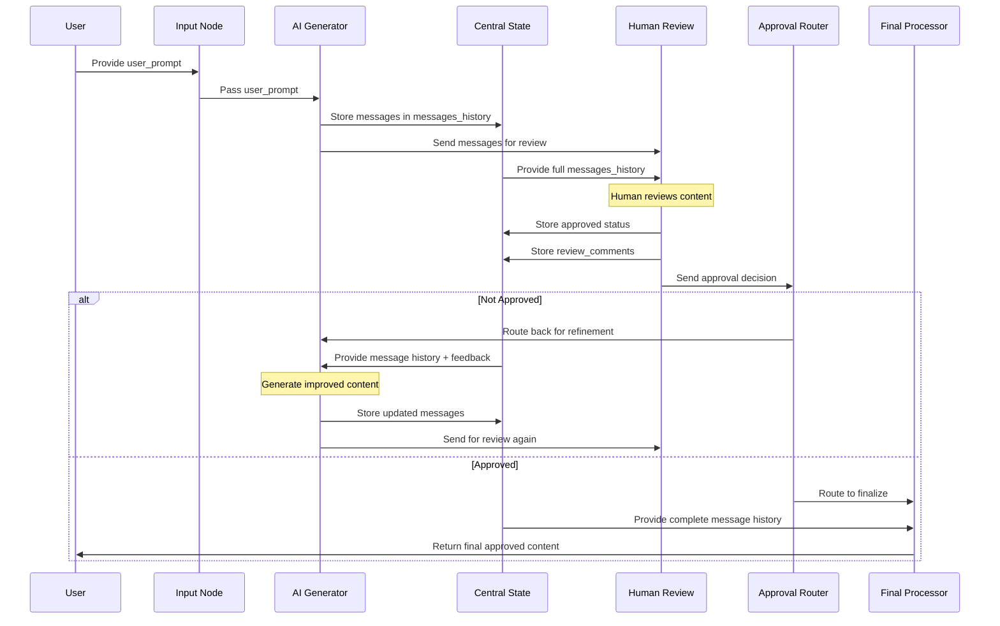
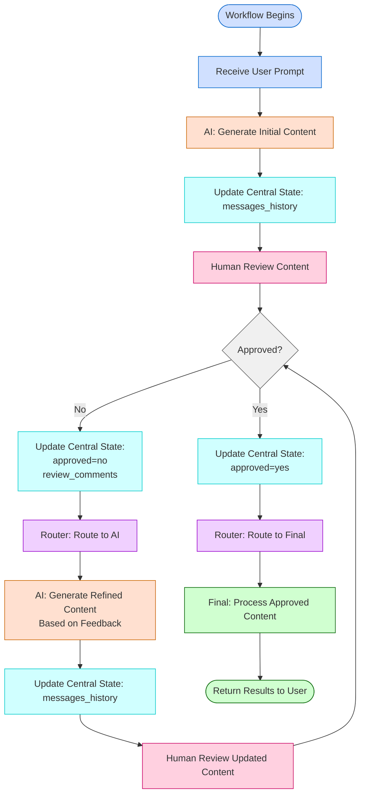
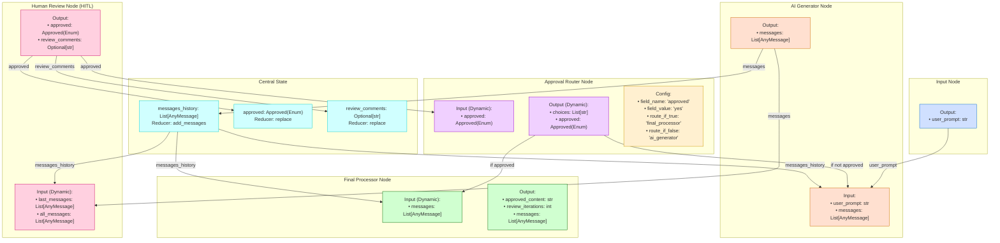
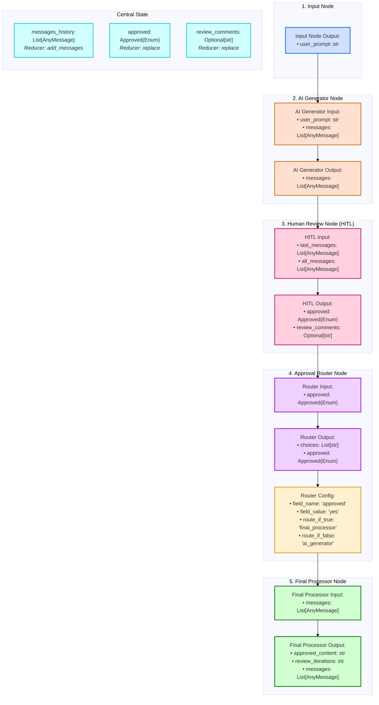

# Workflow Example Template

# AI-Human Feedback Loop Workflow: Detailed Template (3 Pages)

## 1. Workflow Overview

**Name**: AI Content Generation with Human Review Loop

**Purpose**: Generate AI content based on a user prompt, have a human review it, and either finalize or refine based on feedback

**Primary Input**: User prompt (text string)

**Primary Output**: Approved content with iteration history

## Diagrams

**(NOTE: may render better in light theme / white background!)**

**(NOTE: adding mermaid codes too to make doc machine readable more easily)**

### **Workflow Sequence Diagram —>**



### **Workflow Flow**



### Full Workflow Diagram (image zoomable)




## 2. Detailed Node Schemas

### 2.1 Input Node

**Type**: System Input Node

- **Input Schema**: N/A (system node)
- **Output Schema**:
    
    ```python
    class InputSchema(BaseSchema):
        user_prompt: str = Field(description="User prompt for AI generation")
    
    ```
    
- **Config Schema**: None (system node)
- **Purpose**: Entry point that receives the initial user prompt

### 2.2 AI Generator Node

**Type**: Processing Node

- **Input Schema**:
    
    ```python
    class MessagesWithUserPromptSchema(MessagesSchema):
        user_prompt: str = Field(description="User prompt for AI generation")
        messages: List[AnyMessage] = Field(default_factory=list, description="Previous conversation history")
    
    ```
    
- **Output Schema**:
    
    ```python
    class MessagesSchema(BaseSchema):
        messages: List[AnyMessage] = Field(default_factory=list, description="Generated AI messages")
    
    ```
    
- **Config Schema**: None
- **Purpose**: Generates AI content based on prompt and previous feedback
- **Logic Details**:
    - Counts existing AI messages to track iteration number
    - Generates different responses for initial requests vs. refinements
    - Metadata includes iteration count and timestamps

### 2.3 Human Review Node (HITL)

**Type**: Human-in-the-Loop

- **Input Schema**: **DYNAMIC** (explained below)
- **Output Schema**:
    
    ```python
    class UserInputSchema(BaseSchema):
        approved: Approved = Field(description="Approval status (yes/no as enum)")
        review_comments: Optional[str] = Field(None, description="Review comments if not approved")
    
    ```
    
- **Config Schema**: None
- **Purpose**: Collects human review of AI content
- **Special Logic**:
    - Validates that review comments are provided when content is rejected
    - Presents context of full conversation to reviewer

### 2.4 Approval Router Node

**Type**: Router

- **Input Schema**: **DYNAMIC** (explained below)
- **Output Schema**: **DYNAMIC** - **—> HYBRID SCHEMA!**

**NOTE:** Dynamic schemas may be hybrid → a few fields defined as normal schema and rest fields assembled at runtime dynamically from edges!

`choices` here is a normal non-dynamic field and rest of the schema is assembled at runtime.
    
    ```python
    class ApprovalRouterChoiceOutputDynamicSchema(DynamicSchema):
        choices: List[str] = Field(description="List of routing choices", min_length=1)
    
    ```
    
- **Config Schema**:
    
    ```python
    class ApprovalRouterConfigSchema(RouterSchema):
        field_name: str = Field(description="Field name to check for approval")
        field_value: str = Field(description="Value to check for approval")
        route_if_true: str = Field(description="Route to take if field is true")
        route_if_false: str = Field(description="Route to take if field is false")
    
    ```
    
- **Purpose**: Routes workflow based on human approval decision
- **Config Values**:
    - `field_name`: "approved"
    - `field_value`: "yes"
    - `route_if_true`: "final_processor"
    - `route_if_false`: "ai_generator"

### 2.5 Final Processor Node

**Type**: Processing/Output

- **Input Schema**: **DYNAMIC** (explained below)
- **Output Schema**:
    
    ```python
    class FinalOutputSchema(BaseSchema):
        approved_content: str = Field(description="Final approved content")
        review_iterations: int = Field(description="Number of review iterations")
        messages: List[AnyMessage] = Field(description="Complete conversation history")
    
    ```
    
- **Config Schema**: None
- **Purpose**: Formats final output with approved content and metadata



## 3. Dynamic Schema Explanation

### 3.1 Why Schemas Are Dynamic

**Human Review Node - Input Schema**:

- **Why Dynamic?**: The HITL node must see both messages from the AI node and the full conversation history from central state
- **Generated From**: Edges from AI Generator node and central state
- **Resulting Schema**:
    
    ```python
    class DynamicHITLInputSchema(DynamicSchema):
        last_messages: List[AnyMessage] = Field(description="Latest messages from AI")
        all_messages: List[AnyMessage] = Field(description="Full message history from central state")
    
    ```
    

**Approval Router Node - Input Schema**:

- **Why Dynamic?**: Needs to receive approval status from HITL node
- **Generated From**: Edge from Human Review node
- **Resulting Schema**:
    
    ```python
    class DynamicRouterInputSchema(DynamicSchema):
        approved: Approved = Field(description="Approval status from human review")
    
    ```
    

**Approval Router Node - Output Schema**:

- **Why Dynamic?**: Needs to pass through the approval status to preserve it in routing decisions
- **Generated From**: Input fields + choices field
- **Resulting Schema**: Combines standard router output with fields from input
    
    ```python
    # Generated schema includes both choices and approved field
    
    ```
    

**Final Processor Node - Input Schema**:

- **Why Dynamic?**: Needs to receive the complete message history
- **Generated From**: Edge from central state
- **Resulting Schema**:
    
    ```python
    class DynamicProcessorInputSchema(DynamicSchema):
        messages: List[AnyMessage] = Field(description="Complete message history from central state")
    
    ```
    

### 3.2 Dynamic Schema Generation Process

1. **Edge Analysis**: The system examines all edges connecting to a node with dynamic schemas
2. **Field Collection**: For each incoming edge, collects the field name and type from the source
3. **Schema Construction**: Creates a new schema class with all collected fields
4. **Validation Rules**: Preserves validation rules (required/optional) from source fields
5. **Type Consistency**: Ensures compatible types when multiple edges target the same field

## 4. Central State Fields

| Field Name | Type | Purpose | Reducer Type | Reducer Logic |
| --- | --- | --- | --- | --- |
| `messages_history` | List[AnyMessage] | Store conversation | add_messages | Adds new messages to history, preserving order |
| `approved` | Approved (Enum) | Track approval status | replace | Replaces previous value with new approval status |
| `review_comments` | Optional[str] | Store feedback | replace | Replaces previous value with new comments |

## 5. Edge Definitions with Detailed Field Mappings

### 5.1 Input to AI Generator

- **Source**: Input Node → `user_prompt` (str)
- **Destination**: AI Generator → `user_prompt` (str)
- **Purpose**: Passes initial prompt to AI generator

### 5.2 Central State to AI Generator

- **Source**: Central State → `messages_history` (List[AnyMessage])
- **Destination**: AI Generator → `messages` (List[AnyMessage])
- **Purpose**: Provides conversation history for context in iterations
- **When Used**: After first iteration, supplies previous messages for refinement

### 5.3 AI Generator to Central State

- **Source**: AI Generator → `messages` (List[AnyMessage])
- **Destination**: Central State → `messages_history` (List[AnyMessage])
- **Purpose**: Updates central message history with new AI response
- **Reducer**: add_messages (appends rather than replaces)

### 5.4 AI Generator to Human Review

- **Source**: AI Generator → `messages` (List[AnyMessage])
- **Destination**: Human Review → `last_messages` (List[AnyMessage])
- **Purpose**: Passes most recent AI output for human review

### 5.5 Central State to Human Review

- **Source**: Central State → `messages_history` (List[AnyMessage])
- **Destination**: Human Review → `all_messages` (List[AnyMessage])
- **Purpose**: Provides full conversation context for human reviewer

### 5.6 Human Review to Central State (2 edges)

- **Source 1**: Human Review → `approved` (Approved enum)
- **Destination 1**: Central State → `approved` (Approved enum)
- **Source 2**: Human Review → `review_comments` (Optional[str])
- **Destination 2**: Central State → `review_comments` (Optional[str])
- **Purpose**: Stores review decisions in central state

### 5.7 Human Review to Approval Router

- **Source**: Human Review → `approved` (Approved enum)
- **Destination**: Approval Router → `approved` (Approved enum)
- **Purpose**: Passes approval status for routing decision

### 5.8 Approval Router to Next Nodes (Conditional)

- **To AI Generator**: No field mapping (conditional execution only)
    - **Condition**: `choices[0] == 'ai_generator'` (when not approved)
- **To Final Processor**: No field mapping (conditional execution only)
    - **Condition**: `choices[0] == 'final_processor'` (when approved)

### 5.9 Central State to Final Processor

- **Source**: Central State → `messages_history` (List[AnyMessage])
- **Destination**: Final Processor → `messages` (List[AnyMessage])
- **Purpose**: Provides complete conversation for output preparation

## 6. Loop Mechanism Explained

### 6.1 Loop Structure

- AI Generator → Human Review → Approval Router → (back to) AI Generator

### 6.2 How the Loop Works

1. AI generates content (stored in central state)
2. Human reviews and provides approval/comments
3. Router checks approval status
4. If not approved, routes back to AI Generator
5. AI has access to previous messages via central state
6. AI incorporates feedback and generates improved content
7. Loop continues until human approves

### 6.3 Loop Exit Condition

- Human reviewer sets `approved = "yes"`
- Router directs flow to Final Processor instead of back to AI
- Final Processor creates output with approved content

## 7. Technical Implementation Notes

### 7.1 Message Handling with Reducers

- The `add_messages` reducer ensures messages are appended to history
- This allows the AI to see all previous messages when refining content
- Implementation uses `langchain_core.messages.add_messages` field annotation

### 7.2 Enum Type for Approval

- Uses Enum for approved status to enforce valid options
- Simplifies router logic by having standardized values

### 7.3 Schema Validation

- UserInputSchema validates that review comments are provided when content is rejected
- Uses Pydantic's `model_validator` to enforce this business rule

### 7.4 Dynamic Schema Implementation

- DynamicSchema base class enables extensible schemas
- Fields are added at runtime based on edge connections
- Router outputs inherit input fields to maintain state during routing

## 8. Design Considerations and Rationale

### 8.1 Why Use Central State for Message History

- **Persistence**: Messages need to be available across multiple iterations
- **Cross-Node Access**: Both AI and Final Processor need access
- **Append Operation**: Messages need to accumulate rather than replace

### 8.2 Why Make Router Schema Dynamic

- Allows router to pass through input fields to maintain workflow state
- Simplifies edge design by not requiring explicit mappings for pass-through data
- Enables more flexible routing patterns

### 8.3 Design Decisions for HITL Node

- Separates latest messages from full history for clearer presentation
- Requires comments when rejecting to ensure meaningful feedback
- Exposes validation logic explicitly for better user experience