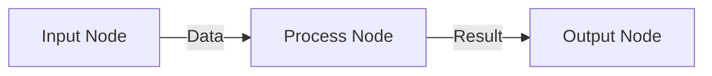
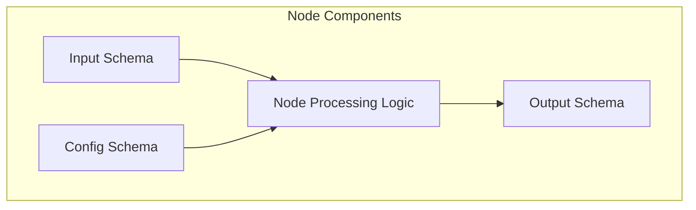
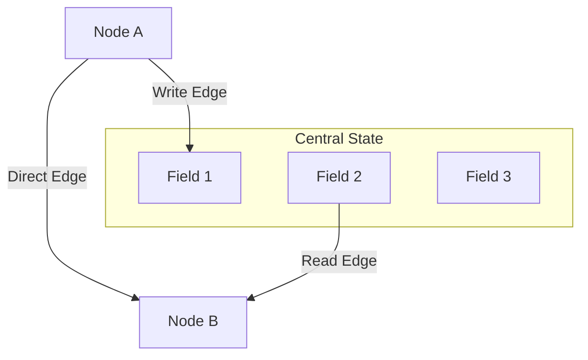
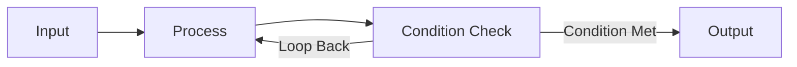
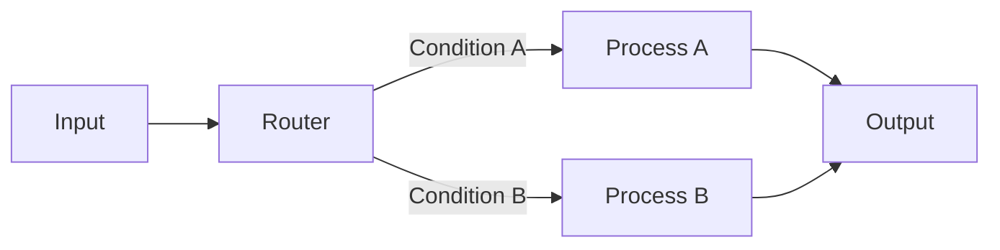

# Workflows Guide & Concepts

# Workflow Service Comprehensive Guide

## 1. Introduction to Workflow Service

A workflow service enables you to build structured, reusable processes by connecting specialized components (nodes) that pass data between them. Think of it as assembling building blocks to create automated, intelligent processes that can include human touchpoints when needed.



## 2. Core Components and Concepts

### 2.1 Nodes

**Nodes** are the fundamental building blocks that perform specific functions.

**Types of Nodes:**

- **Input Nodes**: Entry points for data
- **Processing Nodes**: Transform or generate data
- **HITL Nodes**: Human-in-the-Loop for review/decisions
- **Router Nodes**: Direct flow based on conditions
- **Output Nodes**: Format and deliver final results



```
┌────────┐    ┌───────────┐    ┌───────────┐    ┌─────────┐
│  Input │───►│ AI Node   │───►│ HITL Node │───►│ Router  │
└────────┘    └───────────┘    └───────────┘    └─────────┘
                                                     │
                    ┌───────────────────────────────┴───────────────┐
                    ▼                                               ▼
              ┌──────────┐                                   ┌──────────┐
              │ AI Node  │◄──────────────────────────────── │  Output  │
              └──────────┘          (loop back)             └──────────┘

```

### 2.2 Schemas

Every node has three types of schemas:
**NOTE:** Any field may have default values, and be marked as optional / required.

1. **Input Schema**: Defines expected input data structure
    
    ```python
    class AIInputSchema(BaseSchema):
        user_prompt: str
        messages: List[Message] = []
    
    ```
    
2. **Output Schema**: Defines produced output data structure
    
    ```python
    class AIOutputSchema(BaseSchema):
        messages: List[Message]
    
    ```
    
3. **Config Schema**: Defines node configuration options
    
    ```python
    class RouterConfigSchema(BaseSchema):
        field_name: str = "approved"
        field_value: str = "yes"
        route_if_true: str
        route_if_false: str
    
    ```
    

### 2.3 Edges

**Edges** connect nodes and define how data flows between them.

```
┌────────┐   user_prompt   ┌──────────┐
│  Input │─────────────────► AI Node  │
└────────┘                 └──────────┘
                               │
                               │ messages
                               ▼
                           ┌─────────┐
                           │  HITL   │
                           └─────────┘

```

**Edge Types:**

- **Direct Edges**: Connect output of one node to input of another
- **Central State Edges**: Connect nodes to/from shared state repository

### 2.4 Central State

The **Central State** is a shared data repository accessible by all nodes.



```
                     ┌──────────────────┐
                     │  Central State   │
                     │ ┌─────────────┐  │
                     │ │messages_hist│  │
                     │ └─────────────┘  │
                     │ ┌─────────────┐  │
                     │ │  approved   │  │
                     │ └─────────────┘  │
                     │ ┌─────────────┐  │
                     │ │review_cmts  │  │
                     │ └─────────────┘  │
                     └──────────────────┘
                      ▲     ▲     │     │
           messages_hist│     │     │
                      │     │     │     │
           ┌──────────┐     │     │     │
           │ AI Node  │     │     │     │
           └──────────┘     │     │     │
                            │     │    messages_hist
                    approved│     │     │
                            │     │     │
                      ┌─────────┐ │     │
                      │  HITL   │ │     │
                      └─────────┘ │     │
                                  │     │
                                  │     │
                                  │     ▼
                                  │  ┌──────────┐
                                  └──│  Final   │
                                     └──────────┘

```

**Key Functions:**

- **Data Persistence**: Maintains data across workflow steps
- **Cross-Node Communication**: Enables non-adjacent nodes to share data
- **State Management**: Crucial for loops and complex patterns

## 3. Building Workflows Step-by-Step

### 3.1 Define Node Schemas

Start by defining clear schemas for each node:

1. **Define Input Schema**:
    - List required and optional fields
    - Specify data types and validations
    - Example:
        
        ```python
        class MessagesWithUserPromptSchema(BaseSchema):
            user_prompt: str = Field(description="User prompt for content generation")
            messages: List[AnyMessage] = Field(default_factory=list, description="Previous conversation")
        
        ```
        
2. **Define Output Schema**:
    - Clearly specify all output fields
    - Include field descriptions
    - Example:
        
        ```python
        class UserInputSchema(BaseSchema):
            approved: Approved = Field(description="Approval status (yes/no)")
            review_comments: Optional[str] = Field(None, description="Review comments if not approved")
        
        ```
        
3. **Define Config Schema** (if needed):
    - Include configurable parameters
    - Provide sensible defaults
    - Example:
        
        ```python
        class ApprovalRouterConfigSchema(RouterSchema):
            field_name: str = Field(description="Field to check")
            field_value: str = Field(description="Value to check for")
            route_if_true: str = Field(description="Route if match")
            route_if_false: str = Field(description="Route if no match")
        
        ```
        

### 3.2 Plan Central State Fields

Identify what data needs to be shared across nodes:

**Example Central State Plan:**

| Field Name | Type | Purpose | Reducer | Updated By |
| --- | --- | --- | --- | --- |
| `messages_history` | List[Message] | Conversation history | add_messages | AI Generator |
| `approved` | Enum | Approval status | replace | HITL Review |
| `review_comments` | String | Feedback | replace | HITL Review |

### 3.3 Define Edge Connections

Map how data flows through your workflow:

**NOTE:** An edge may also not pass any data but just specify the execution order.

1. **Node-to-Node Edges**:
    
    ```
    Input.user_prompt ─────► AI.user_prompt
    AI.messages ─────────────► HITL.last_messages
    HITL.approved ────────────► Router.approved
    
    ```
    
2. **Node-to-Central State Edges**:
    
    ```
    AI.messages ────────────► CentralState.messages_history
    HITL.approved ──────────► CentralState.approved
    HITL.review_comments ───► CentralState.review_comments
    
    ```
    
3. **Central State-to-Node Edges**:
    
    ```
    CentralState.messages_history ───► AI.messages
    CentralState.messages_history ───► HITL.all_messages
    CentralState.messages_history ───► Final.messages
    
    ```
    

### 3.4 Configure Routers and Loops

Define conditional logic and loop patterns:

```
Router:
  IF approved == "yes" → Final Processor
  ELSE → AI Generator (for refinement)

```

## 4. Dynamic Schemas and Advanced Features

### 4.1 When to Use Dynamic Schemas

Dynamic schemas adapt their structure based on connections and configuration.

**Use Dynamic Schemas When:**

- A node connects to variable data sources
- HITL nodes need flexibility for different review types
- Router nodes need to pass through data while directing flow

### 4.2 How Dynamic Schemas Work

1. **Edge Analysis**: The system examines incoming/outgoing edges
2. **Field Collection**: Gathers fields from connected nodes
3. **Schema Generation**: Creates a composite schema with all required fields

**Example**: HITL Node with Dynamic Input Schema

- Receives `last_messages` from AI Generator
- Receives `all_messages` from Central State
- System generates composite schema with both fields

### 4.3 Hybrid Schemas

**NOTE:** Dynamic schemas may be hybrid → a few fields defined as normal schema and rest fields assembled at runtime dynamically from edges!

### 4.4 Reducers for Central State

Reducers control how data is combined in central state:

1. **Replace Reducer** (default):
    - Overwrites existing values
    - Use for status fields, configuration
2. **Append Reducer**:
    - Adds to existing collections
    - Essential for conversation history
    - Example: `add_messages` for appending to message list
3. **Custom Reducers**:
    - Implement special logic for specific data types
    - Example: Aggregation, filtering, transformation

## 5. Common Workflow Patterns

### 5.1 AI-Human Feedback Loop

```
┌────────┐    ┌───────────┐    ┌───────────┐    ┌─────────┐
│  Input │───►│ AI Node   │───►│ HITL Node │───►│ Router  │
└────────┘    └───────────┘    └───────────┘    └─────────┘
                 ▲                                    │
                 │                                    │
                 └────────────────────────────────────┘
                        (if not approved)

```



**Implementation Details:**

- AI generates content based on prompt
- Human reviews and approves/rejects
- If rejected, AI regenerates with feedback
- Central State maintains conversation history
- Loop continues until approval

### 5.2 Conditional Branching

```
                    ┌───────────┐
                 ┌─►│ Process A │─┐
┌────────┐    ┌──┴──┐           │ │    ┌────────┐
│  Input │───►│Router├───────────┘ ├───►│ Output │
└────────┘    └──┬──┘             │    └────────┘
                 └─►┌───────────┐ │
                    │ Process B │─┘
                    └───────────┘

```



**Implementation Details:**

- Router node evaluates conditions
- Directs flow to different processing paths
- Paths rejoin at a common endpoint

### 5.3 Parallel Processing —> NOTE: this is tricky and WIP; FAN IN / FAN OUT is handled in a very tricky way by Langgraph! Avoid using this pattern for now and discuss with the team!

```
                    ┌───────────┐
                 ┌─►│ Process A │─┐
┌────────┐    ┌──┴──┐           │ │    ┌────────┐
│  Input │───►│ Fan  │           │ ├───►│ Reduce │───►Output
└────────┘    │ Out  │           │ │    └────────┘
                 └─►┌───────────┐ │
                    │ Process B │─┘
                    └───────────┘

```

**Implementation Details:**

- Fan-out distributes work
- Processes run independently
- Results combine at reducer node

## 6. Best Practices and Gotchas

### 6.1 Schema Design

**Best Practices:**

- ✅ Keep schemas focused and specific
- ✅ Use descriptive field names and types
- ✅ Include validation rules (min/max, patterns)
- ✅ Document fields with clear descriptions

**Gotchas:**

- ❌ Overly generic schemas make debugging difficult
- ❌ Mismatched types between connected fields cause errors
- ❌ Missing validation rules can lead to unexpected behavior

### 6.2 Central State Management

**Best Practices:**

- ✅ Plan which data needs central state persistence
- ✅ Use appropriate reducers for each field type
- ✅ Be explicit about which nodes read/write to central state

**Gotchas:**

- ❌ Using default replace reducer for lists will overwrite history
- ❌ Multiple nodes updating same field without proper reducers
- ❌ Central state fields without readers/writers waste resources

### 6.3 Loop Design

**Best Practices:**

- ✅ Include clear exit conditions
- ✅ Use central state for data persistence across iterations
- ✅ Consider iteration limits to prevent infinite loops

**Gotchas:**

- ❌ Missing exit conditions create infinite loops
- ❌ Not preserving context between iterations
- ❌ Overwriting rather than appending to history

### 6.4 HITL Integration

**Best Practices:**

- ✅ Provide clear context to human reviewers
- ✅ Validate human input to ensure quality
- ✅ Include helpful field descriptions

**Gotchas:**

- ❌ Insufficient context leads to poor human decisions
- ❌ Missing validation for human input
- ❌ Not handling edge cases (timeouts, invalid responses)

## 7. Practical Example: AI Review Workflow Explained

### 7.1 Workflow Purpose

Create a system where:

1. AI generates content based on user prompt
2. Human reviews content
3. If approved, finalize output
4. If rejected, AI refines content based on feedback
5. Process repeats until content is approved

### 7.2 Node Configuration

1. **Input Node**:
    - Simple entry point with `user_prompt` field
2. **AI Generator Node**:
    - Takes `user_prompt` and optional `messages` history
    - Outputs new AI-generated messages
    - Tracks iteration count internally
3. **Human Review Node**:
    - Takes latest AI messages and full conversation history
    - Outputs approval status and optional review comments
    - Enforces validation: comments required if rejected
4. **Approval Router Node**:
    - Takes approval status from human review
    - Routes to AI Generator if rejected
    - Routes to Final Processor if approved
5. **Final Processor Node**:
    - Takes full message history
    - Outputs approved content, iteration count, and history

### 7.3 Central State Design

- `messages_history`: Stores all messages with append reducer
- `approved`: Stores approval status with replace reducer
- `review_comments`: Stores feedback with replace reducer

### 7.4 Edge Configuration

1. **Direct Edges**:
    - Input → AI: Passes initial prompt
    - AI → HITL: Passes generated messages for review
    - HITL → Router: Passes approval decision
    - Router → AI/Final: Conditional execution paths
2. **Central State Edges**:
    - AI → Central State: Stores messages in history
    - Central State → AI: Provides previous messages for context
    - Central State → HITL: Provides full conversation for review
    - Central State → Final: Provides complete history for output

### 7.5 Loop Mechanism

1. AI generates initial content
2. Human reviews and either approves or provides feedback
3. Router checks approval status
4. If rejected, flow returns to AI with feedback context
5. AI incorporates feedback to generate improved content
6. Process repeats until approval, then finalizes output

### 7.6 Special Implementation Details

1. **Message History Handling**:
    - Uses specialized `add_messages` reducer
    - Ensures proper message ordering and threading
2. **Typed Approvals**:
    - Uses Enum type (`Approved.YES` / `Approved.NO`)
    - Ensures consistent values for router logic
3. **Dynamic Schema for Router**:
    - Preserves approval status through routing decision
    - Simplifies edge design for conditional paths

## 8. Implementation Checklist

When designing your workflow:

1. □ Define node purposes and responsibilities
2. □ Design input/output schemas with proper types
3. □ Plan central state fields and reducers
4. □ Map edge connections between nodes
5. □ Configure router logic and loop patterns
6. □ Test with various inputs and edge cases
7. □ Add validation rules to prevent errors
8. □ Document workflow behavior and requirements

By following this guide, you can create robust, maintainable workflows that handle complex processes with both AI and human components working together seamlessly.